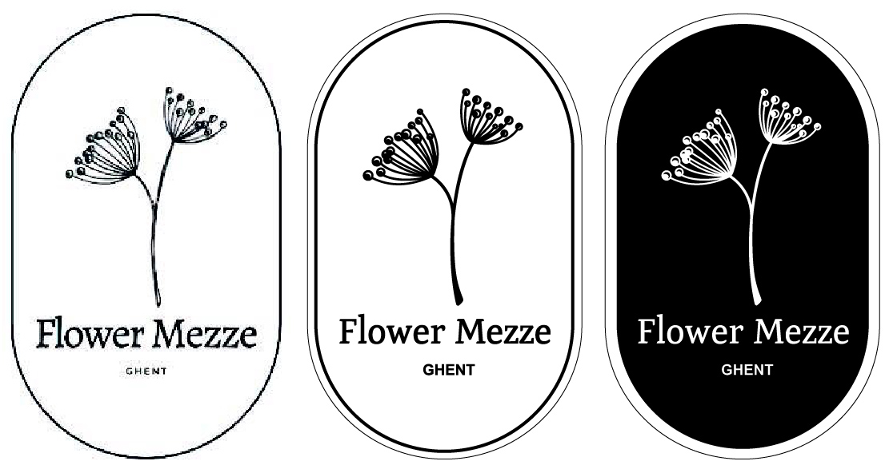
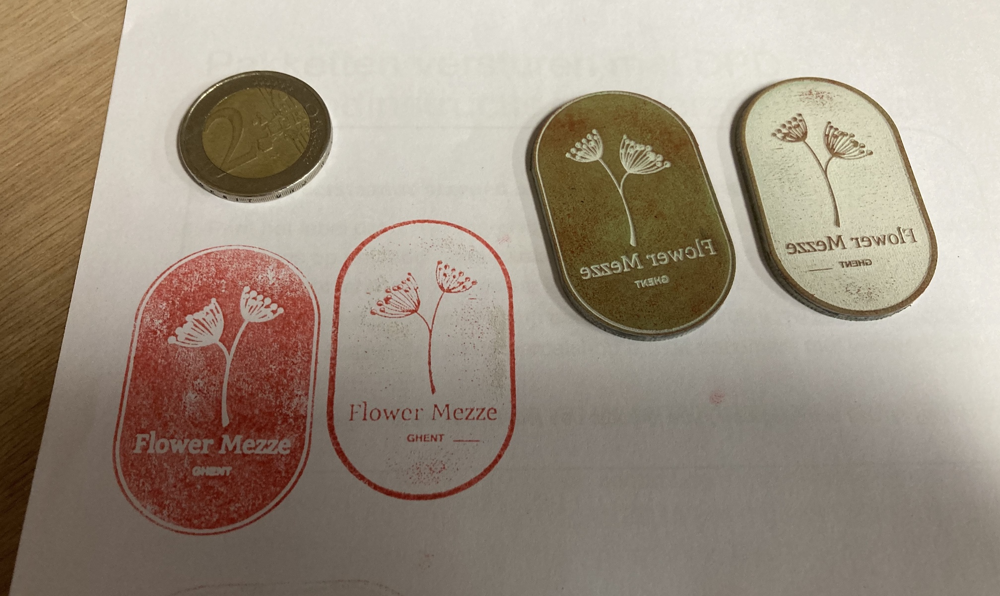
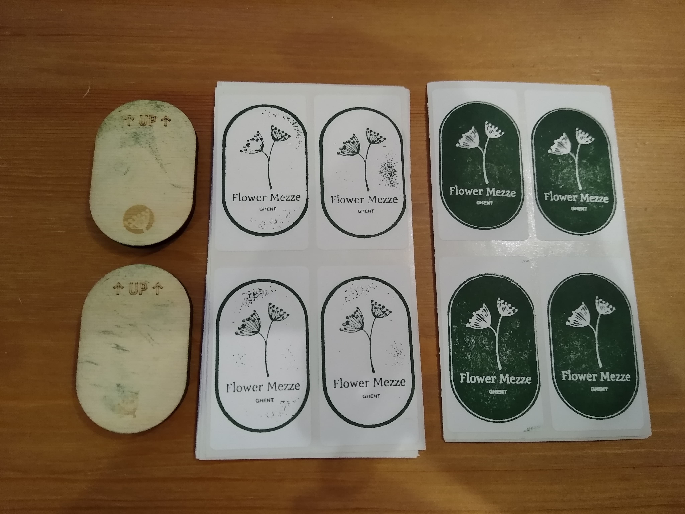
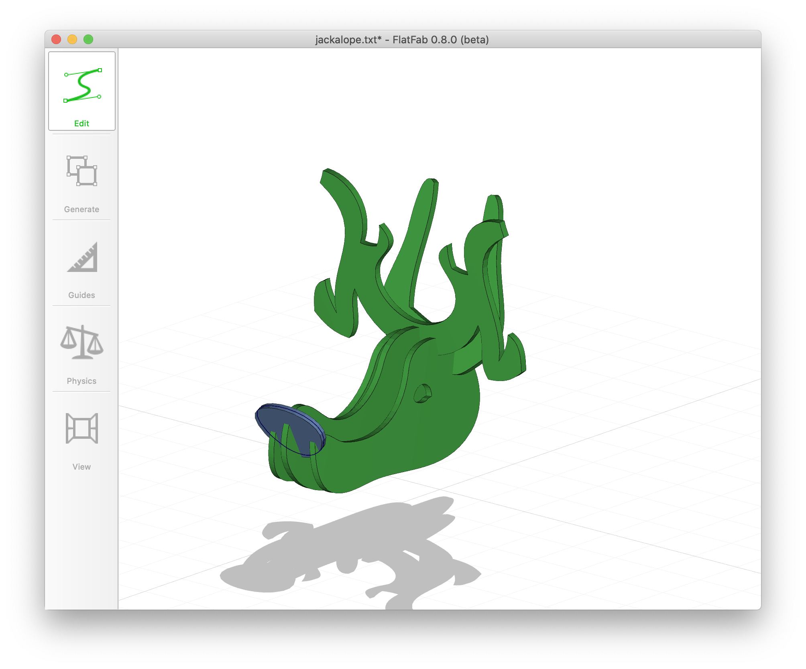

# Week 3: 2D ontwerpen en lasersnijden

## Stempel

De vriendin van een vriend is bezig met een bedrijfje uit de grond te stampen met huisgemaakt Libanees eten. Laat ons zeggen dat ik het logo nogal… uitdagend vond om tot een stempel te verwerken, en wou nagaan in hoeverre de lasersnijder de details aankon. Stap één was het hertekenen van het logo en de tekst (veel te gepixeld voor een _image trace_). Ik wist nog niet of ik het logo rechtstreeks of het negatief wou, dus hield ik ze beide bij.

Voor een eerste poging liet ik de machine los op 2 mm dik rubber, de figuur 50 mm hoog. Niet vergeten spiegelen! Ik verwachtte eigenlijk niet veel soeps en dacht de tekeningen ofwel dikker ofwel groter te moeten maken. Ook bleek later dat ik de focus van de laser was vergeten instellen… Het resultaat verbaasde me dan ook.

Best goed geslaagd! In de linkse stempel blijken de details in de bolletjes verloren, op de afdruk zie je enkel egaal witte bolletjes. In de rechtse stempel heeft de lasersnijder een fijne lijn gemist (net rechts van de tekst ''GHENT'') maar dat viel eenvoudig bij te werken met een hobbymesje. Daarna dacht ik na over een handigere manier om vast te houden. Een handvat bestaande uit 2D-componenten hout leek me eigenlijk niet zo ergonomisch. Ik opteerde dan ook voor een eenvoudig stukje hout waarop ik enkele aantekeningen liet graveren, dat ik daarna aan de stempel plakte. Het idee was dan om bovenop dit stukje hout nog een kurk te plakken, maar zo ver is het niet gekomen: de stempels werden de volgende dag al veelvuldig ingezet en zagen er na een honderdtal keer stempelen uit als volgt.

Dus, zorg ervoor dat je een volledig afgewerkt en meteen bruikbaar product aflevert &#9786;

## FlatFab

Conceptueel sprak FlatFab mij sterk aan, en ik prutste dan ook graag eens iets in elkaar. Ver ben ik nog niet geraakt; FlatFab heeft een redelijk stijle leercurve doordat een aantal belangrijke tools en opties nogal verstopt zitten, en het tekenen soms best onhandig is. Toen bleek dat men niet onder het _xy_-vlak kan tekenen en ik nergens een mogelijkheid vond om mijn figuur (een [jackalope](https://en.wikipedia.org/wiki/Jackalope)) in zijn geheel omhoog te verplaatsen, heb ik het zonder veel voldoening bij de kop gehouden.

