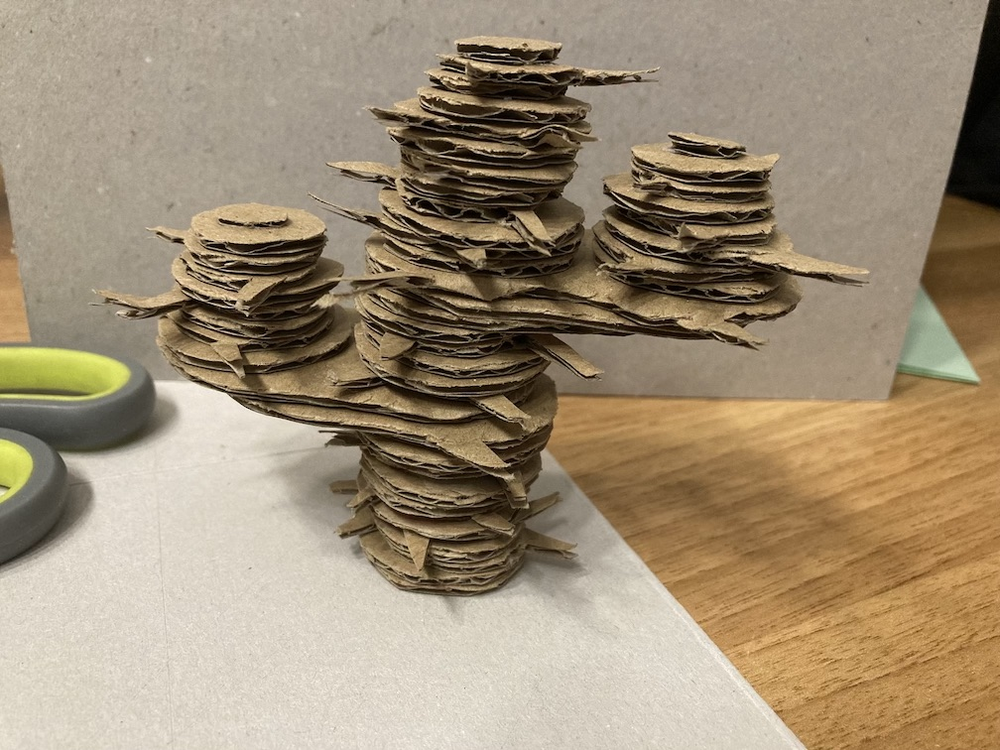
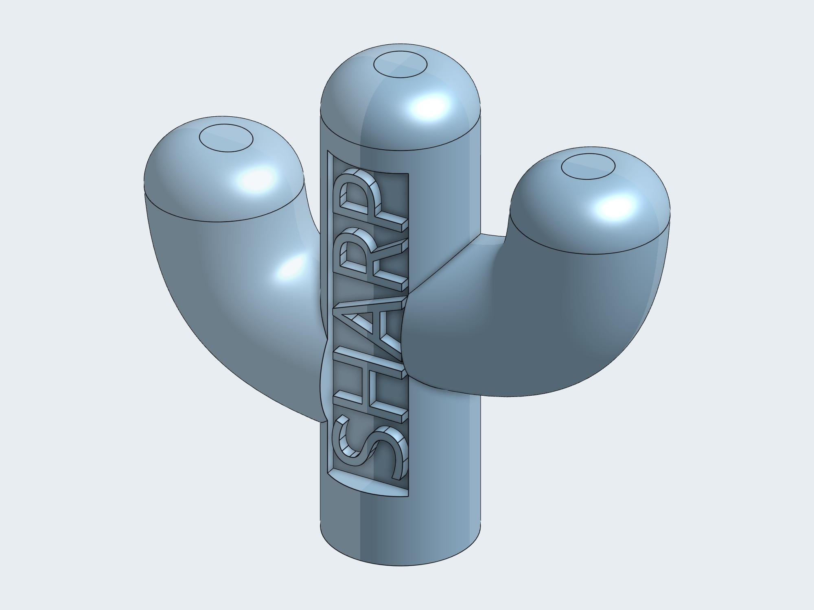
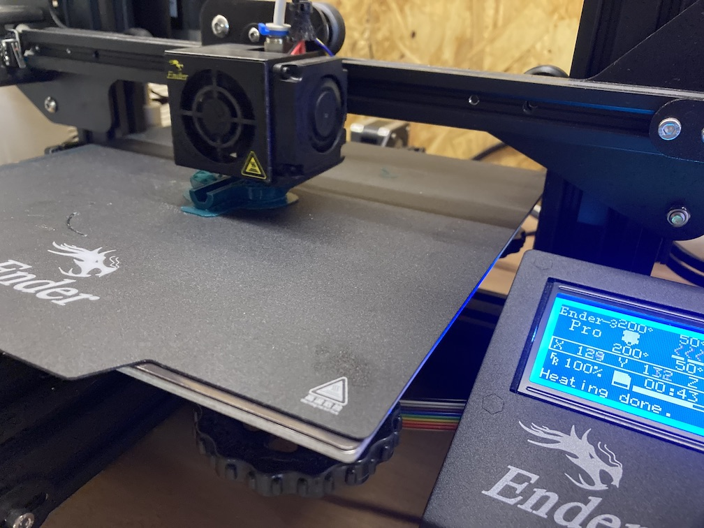
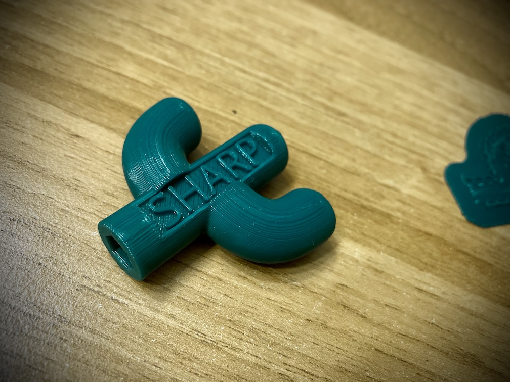
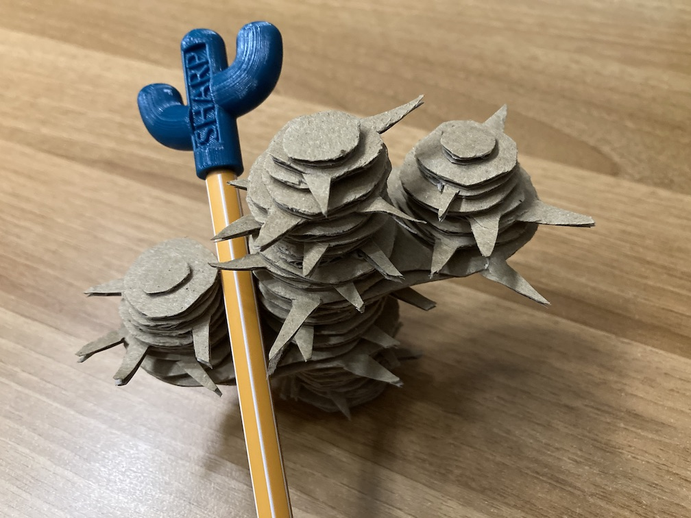

# Week 4: 3D ontwerpen en 3D-printen

## "Ambachtelijk" 3D-printen

Een eenvoudige oefening om vertrouwd te geraken met het concept van de (PLA) 3D-printer, bestond erin om een 3D-object te knutselen door ribbelkarton uit te snijden (of knippen) en in laagjes op elkaar te plakken. De opdracht was eigenlijk een boom; de rebel in mij maakte daar een cactus van. Zoals wel verwacht blijken stekels een pijnpuntje &#9786;

## Potloodgadget

De cactus leek me best een leuke vorm voor op een potlood, en als een kleine woordspeling wou ik er de tekst _*SHARP*_ op. Tinkercad leek wat te rudimentair dus ik trachtte om de cactus te 3D-tekenen in Onshape. Na wat prutsen om de juiste tools te vinden, was [dit](https://cad.onshape.com/documents/30b6a033b744779b682b0461/) het resultaat. De tekst was verrassend lastig goed te krijgen in Onshape, en ik heb ook tevergeefs gezocht naar een manier om iets van textuur toe te voegen aan het oppervlak. Bovendien bleek er in het geëxporteerde `stl`-bestand een vreemde rechthoek te zweven boven de tekst.

Hoe oriënteren we de figuur best om overhang te vermijden? Gewoon rechtop was het meest straightforward te ontwerpen, maar niet om te printen &mdash; dan zijn de armen problematisch, en in mindere mate ook de tekst (die slechts een millimeter uitsteekt, maar wel scherp moet zijn). Vandaar de voorkeur om 'm neerliggend te printen met slechts een minimale ondersteuning van een _raft_. De (in Onshape onzichtbare) zwevende rechthoek had met een dikte van nul gelukkig geen invloed op het 3D-printproces.

Het resultaat was best oké, aangenaam scherp.

Helaas heb ik nu praktisch ondervonden hoeveel handiger een schuifmaat is ten opzichte van een onhandige klassieke meetlat… Het zeshoekig gat onderin bleek een millimeter te klein voor een potlood. Er past wel juist een stift op &#9786;

