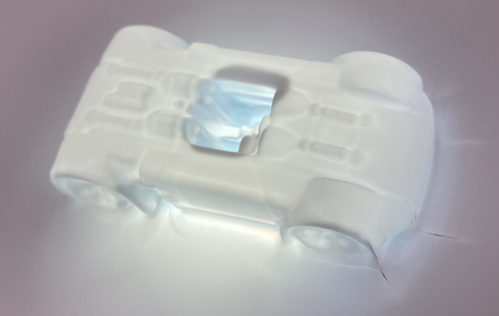

# Week 7a: _thermoforming_

Geen huiswerk voor deze (optionele) extra sessie, dus bij deze gewoon enkele sfeerbeelden.

Zoals te verwachten zijn LEGO-figuurtjes en andere poppetjes met veel ronde vormen lastig, omdat het plastiek ook onder het figuurtje wordt getrokken en dat het losmaken heel moeilijk maakt. Zelfs een LEGO-blokjes is niet evident omwille van de scherpe randen en het gebrek aan gaatjes. De thermoformer kon de bovenkant niet goed vacuüm trekken (en dus vorm geven). Het best geslaagde was nog wel een speelgoedautootje, al was het nog steeds een heel karwei om die uit het plastiek te krijgen.

In combinatie met led-lichtjes geven gethermovormde figuren in combinatie met een led-lichtje heel mooie effecten. Het plastiek wordt namelijk nooit uniform rond een mal getrokken; langs rechtopstaande stukken wordt het plastiek meer uitgerekt en dus wat dunner. Dat verschil in dikte wordt geaccentueerd met een lichtje eronder.

