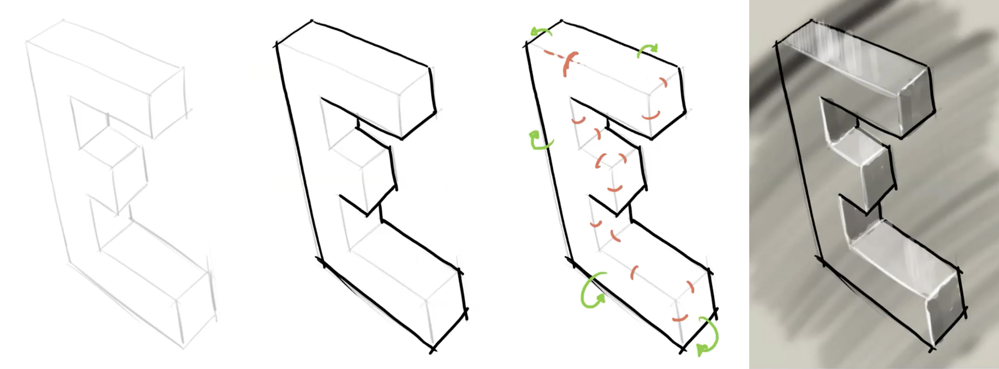

# Week 9a: _product presentation_

Een oefening om een eenvoudige lijntekening in perspectief heel snel wat aantrekkelijker in te kleden. De zichtbare randen komen in twee soorten: enerzijds zijn er randen met twee _zichtbare_ aangrenzende vlakken, en anderzijds zijn er randen die slechts één zichtbaar aangrenzend vlak begrenzen. De eerste soort laten we licht (of overtrekken we digitaal met wit), de tweede soort maken we donker. Het perspectief komt zo veel beter tot zijn recht en suggereert al een rudimentaire belichting.

De lesgever toonde het als volgt voor:

