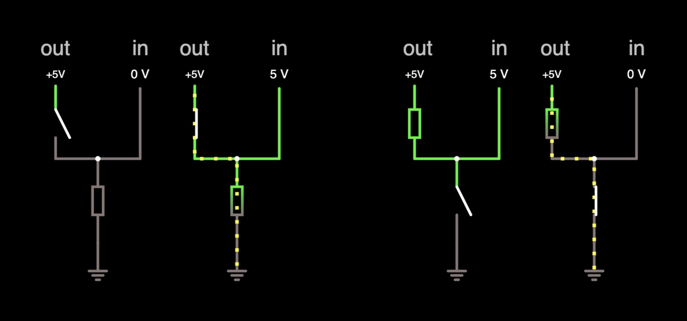
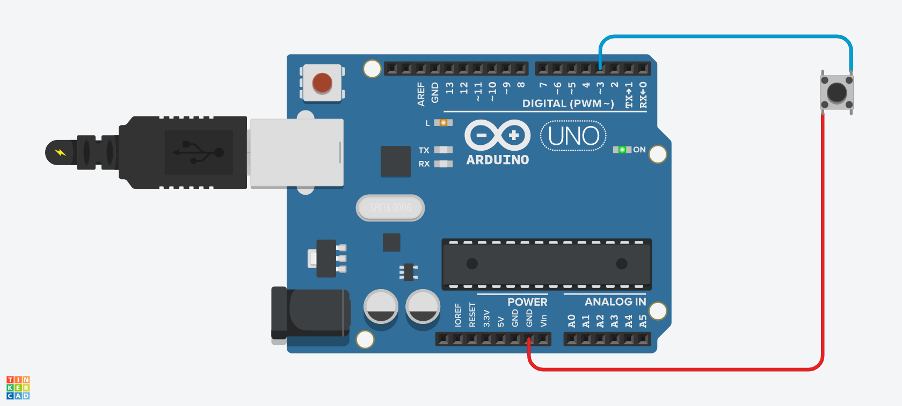
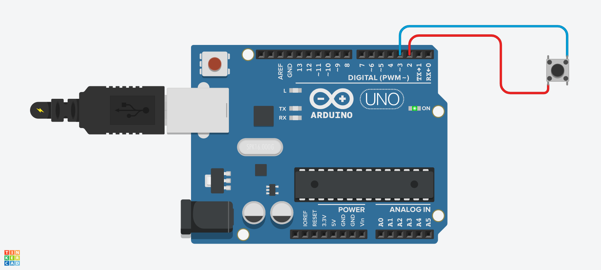

# Basis elektronica & Arduino

Voor het project wensen we één Arduino te gebruiken, zonder bijkomende externe stroom. Daarbij hebben we 64 LEDs en 64 drukknoppen nodig die onafhankelijk van elkaar moeten kunnen oplichten resp.&nbsp;ingedrukt worden. Het theoretisch eenvoudigst zou zijn om elke drukknop te verbinden met een unieke ingang van de Arduino, en elke LED met een unieke uitgang. De Arduino heeft uiteraard geen 128 poortjes en dus moeten we wat creatiever zijn. We kijken al eens naar de noodzakelijke elektronica, waarbij we de Arduino nog beschouwen als een abstracte _black box_ met een aantal pinnen die output kunnen geven of input kunnen opvragen. Het enige wat we moeten weten, zijn de volgende axioma's.
 * Een pin in `OUTPUT`-modus kan in de software een signaal geven van 5 V (`HIGH`) of 0 V (`LOW`).
 * Een pin in `INPUT`-modus waar 5 V op staat, registreert `HIGH`.<br />
  Een pin in `INPUT`-modus waar 0 V op staat, registreert `LOW`.<br />
  Een "floating" pin in `INPUT`-modus, die niet in een gesloten circuit zit, kan zowel `HIGH` of `LOW` registreren.
 * Een pin in `INPUT_PULLUP`-modus waar 5 V op staat, registreert `HIGH`.<br />
  Een pin in `INPUT_PULLUP`-modus waar 0 V op staat, registreert `LOW`.<br />
  Een "floating" pin in `INPUT_PULLUP`-modus, die niet in een gesloten circuit zit, registreert `HIGH` (!!).

[Lees meer hierover.](https://www.arduino.cc/en/Tutorial/Foundations/DigitalPins)

Disclaimer: mijn enige ervaring in dit gebied is louter theoretische middelbareschoolkennis. Het verslag hieronder staat dan ook vol met bedenkingen die voor de elektronicageek volstrekt triviaal zijn, maar de leek misschien wel een hoop kopzorgen en frustratie kunnen besparen.

## Pull-up vs. pull-down resistoren

We beginnen heel simpel: hoe kunnen we de Arduino verbinden met een drukknop en nagaan of die ingedrukt is of niet? Het ligt voor de hand om de drukknop enerzijds te verbinden met een vaste spanningsbron van 5 V en anderzijds met een inputpin van de Arduino. Is de knop ingedrukt, dan sluit het circuit en detecteert de inputpin het signaal `HIGH`. Is anderzijds de knop niet ingedrukt, dan is de inputpin in floating toestand en dan detecteert de pin (in `INPUT`-modus) ruis, bestaande uit variabel `HIGH` en `LOW`. Niet bruikbaar dus!

We moeten gebruikmaken van de pin in `INPUT_PULLUP`-modus, die we dan via de drukknop moeten verbinden met een vaste "spanningsbron" van 0 V (de grond). Is de knop ingedrukt, dan detecteert de pin het signaal `LOW`. Is de knop niet ingedrukt, dan detecteert de pin het signaal `HIGH`. Nogal contra-intuïtief, maar zo kunnen we wel de toestand van de knop eenduidig bepalen uit het opgepikte signaal met een minimum aan elektronica.

Vanwaar de benaming _"pull up"_? Dat verwijst naar het gebruik van een weerstand ingebouwd in de pin die softwarematig wordt geactiveerd. Los van de Arduino zijn er twee manieren om een weerstand te integreren in een drukknopcircuit om de onvoorspelbaarheid van floating waarden tegen te gaan: _pulling down_ en _pulling up_.

De _pull down_ staat hieronder links. Daar wordt de spanning in de inputpin naar de grond toe getrokken zodat die ondubbelzinnig de waarde 0 V aangeeft. De drukknop sluiten doet spanning in input oplopen tot 5 V, en doet een stroom naar de grond ontstaan (vandaar de weerstand). De _pull up_ hieronder rechts doet het omgekeerde: die trekt default de spanning in de inputpin op, zodat die ondubbelzinnig de waarde 5 V aangeeft, tot de drukknop wordt gesloten en de stroom naar de grond kan afvloeien. [Klik hier voor een simulatie in de applet Falstad.](http://falstad.com/circuit/circuitjs.html?ctz=CQAgjCAMB0l3BWcMBMcUHYMGZIA4UA2ATmIxAUgpABZsAoAJXBpvBTxbbDBSn5pUkVEdARMQ2PNw6Tp4XvyqDqIqGPoBzcMT65uuydkJQttbHshs6e46YDOXdpzCsQaTlQgAXAE4BXAFN6AHl3FV5OFAjFCEhQ2jwvWRokhT44+gB3cOSolQ9TXx1LAz5Cr3hsp0KwQwrquvL8XPcW+OKpGU4uts9kOHpHGz7zUv4fAOCc3sKRhpz5ltSqBcTV5bTI0wAPNuJ3O2wwVewDtmiQAAd-ABtbgB17ABMAeyyAO3o91gOUOwQdUO53C1zuj3s-iu33Y5GIXkIVGI2FooNe-m8MP+EHh4QOyNRlwAll89tgMDjlFYQASLmx0ZifhSaco8PiUXSQCT6EA)



Ook in de Arduino wordt de waarde van een inputpin met `INPUT_PULLUP`-modus standaard opgetrokken tot `HIGH`. We moeten het circuit dan zodanig ontwerpen dat de knop activeren ervoor zorgt dat in de pin de waarde `LOW` wordt geregistreerd. Nee, `INPUT_PULLDOWN`-modus bestaat niet &#9786;

## Eerste eenvoudige circuit

Dit wetende implementeren we al eens een enkele knop, heel rechttoe-rechtaan, in een Tinkercadsimulatie.



De `GND`-pin (ground) kunnen we interpreteren als een vaste output `LOW`, pin 3 is de inputpin (met pull up), en we gebruiken de ingebouwde LED om aan te geven of de knop is ingedrukt of niet. De code spreekt voor zich.

```c++
void setup() {
  pinMode(3, INPUT_PULLUP);
  pinMode(LED_BUILTIN, OUTPUT);
}

void loop() {
  if (digitalRead(3) == LOW) {
    digitalWrite(LED_BUILTIN, HIGH); //LED on
  } else {
    digitalWrite(LED_BUILTIN, LOW);  //LED off
  }
}
```

We kunnen eventueel ook een andere pin van de Arduino dan de ground gebruiken. Hier stellen we pin 2 in als een pin met vaste output `LOW`, met hetzelfde resultaat. Deze methode zal nuttig blijken verderop, omdat we de outputwaarde van de pin puur softwarematig kunnen wijzigen.



```c++
void setup() {
  pinMode(2, OUTPUT);
  digitalWrite(2, LOW);
  pinMode(3, INPUT_PULLUP);
  pinMode(LED_BUILTIN, OUTPUT);
}

void loop() {
  if (digitalRead(3) == LOW) {
    digitalWrite(LED_BUILTIN, HIGH); //LED on
  } else {
    digitalWrite(LED_BUILTIN, LOW);  //LED off
  }
}
```

Passen we in dit voorbeeld de output aan naar `HIGH` en testen we of de inputpin `HIGH` detecteert, dan merken we op dat de LED non-stop brandt, met of zonder pull up. Vandaar de nood aan de `INPUT_PULLUP`-modus die zonder extra elektronica bruikbare resultaten geeft.
