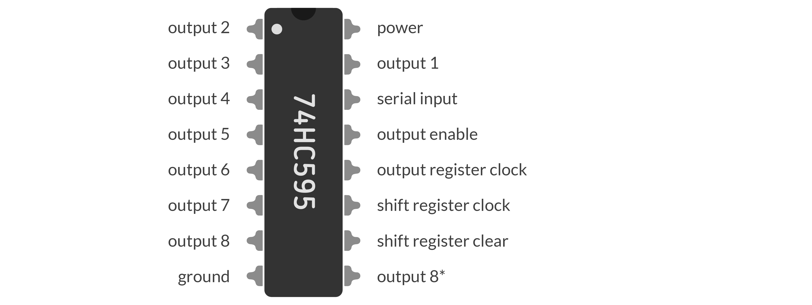
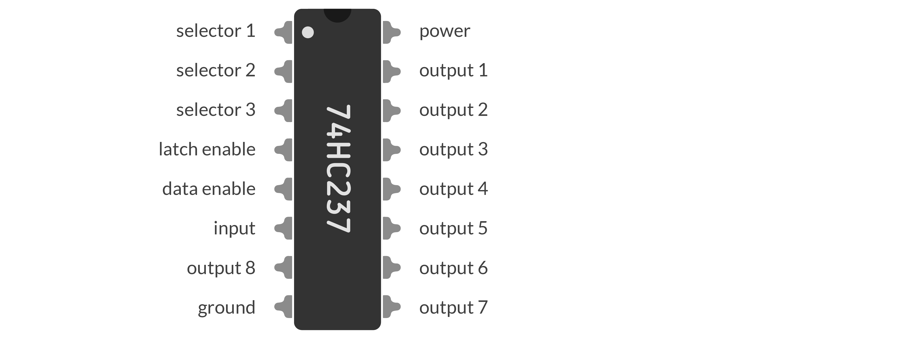

# Matrix van drukknoppen

## Versie 1

We zouden kunnen [het voorbeeld van de vorige pagina](../Project/02.html#eerste-eenvoudige-circuit "negen knoppen") upscalen naar 64 afzonderlijke circuitjes. Softwarematig heel makkelijk te implementeren, maar het probleem van deze methode ligt voor de hand: zelfs als we voor meerdere knoppen een gemeenschappelijke outputpin gebruiken, dan hebben we in totaal nog steeds 64 pinnen nodig voor een 8×8-bord als elke drukknop met een unieke inputpin dient te worden verbonden.

## Versie 2

Een eerste vereenvoudiging zal het probleem van een kwadratisch aantal pinnen (_n_<sup>2</sup> voor een _n_×_n_-spelbord) reduceren naar een lineair aantal (2_n_). Hiervoor verbinden we alle knoppen in een rij van het rooster met eenzelfde outputpin en alle knoppen in een kolom met eenzelfde inputpin, zoals op de figuur.


De Arduino zal herhaaldelijk elk van de outputpinnen eens op `LOW` zetten, voor elk van de inputpinnen controleren of die een `LOW` signaal opvangt, en de outputpin dan weer terugzetten op `HIGH`. Uit de informatie welke inputpin `LOW` geeft bij welke outputpin valt zo te achterhalen welke drukknop precies wordt ingedrukt. Onderstaand programma geeft het principe weer. Dit keer laten we niet gewoon een LEDje oplichten maar schrijft de Arduino naar de console uit welke drukknop gedetecteerd wordt.

```c++
//row pins, top to bottom
const int ROWS[3] = {7, 6, 5};
//column pins, left to right
const int COLS[3] = {2, 3, 4};

void setup() {
  //set pin modes
  for (int n = 0; n < 3; ++n) {
    pinMode(ROWS[n], OUTPUT);
    digitalWrite(ROWS[n], HIGH);
    pinMode(COLS[n], INPUT_PULLUP);
  }
  //allow for output on the console
  Serial.begin(9600);
}

void loop() {
  //loop over rows
  for (int R = 0; R < 3; ++R) {
    digitalWrite(ROWS[R], LOW);
    //loop over columns
    for (int C = 0; C < 3; ++C) {
      //check button in row R, column C
      if (digitalRead(COLS[C]) == LOW) {
        Serial.print("Button ");
        Serial.print(3*R + C + 1);
        Serial.println(" detected!");
      }
    }
    digitalWrite(ROWS[R], HIGH);
  }
  //don't overkill the console
  delay(100);
}
```

Helaas leidt het voorgestelde procédé nog steeds tot 16 pinnen voor het vooropgestelde spelbord. Een merkbare efficiëntiewinst, waarmee we nog steeds zo goed als alle pinnen van de Arduino hebben opgebruikt voor enkel drukknoppen. We willen graag de mogelijkheid openlaten om later uitbreidingsmodules toe te voegen (zoals een elektronische dobbelsteen?) en zoeken dan ook verder naar een elegantere methode.

## Versie 3

Een slimmere oplossing maakt gebruikt van een [_shift register_](https://en.wikipedia.org/wiki/Shift_register) of schuifregister. Grof gezegd is zo'n schuifregister in staat om één serieel inputsignaal te scheiden naar acht afzonderlijke signalen (type _serial-in parallel-out_) of omgekeerd (type _parallel-in serial-out_). Door meerdere schuifregisters aan elkaar te schakelen, zou dat aantal kunnen worden opgetrokken, maar voor onze doeleinden is één zo'n elementje precies gepast. Op deze manier volstaan drie pinnen om acht (en in principe arbitrair veel) rijen van drukknoppen aan te drijven: één voor de data, één voor de "klok", en één om de output effectief uit te schrijven.


In Tinkercad zit de 74HC595 ingebouwd, het meestgebruikte model. Een kort overzicht van het gebruik ervan, zoals zelf [hier](https://lastminuteengineers.com/74hc595-shift-register-arduino-tutorial/) geleerd:



 - **power** vereist een constante `HIGH` en wordt dus best aangesloten op de 5V-uitgang van de Arduino;
 - **ground** vereist een constante `LOW` en wordt dus best aangesloten op de grond van de Arduino;
 - **serial input** ontvangt de seriële input die moet worden doorgegeven;
 - **shift register clock** stuurt op elk `HIGH` signaal de bits één positie door;
 - **output register clock** or **latch** activeert op een `HIGH` signaal de acht uitgangen met de huidige bits;
 - **clear register clock** reset op een `LOW` signaal alle huidige bits op `LOW`;
 - **output enable** blokkeert de uitgangen zolang deze `HIGH` ontvangt;
 - **output 1** t.e.m. **output 8** zijn de effectieve uitgangen;
 - **output 8\*** geeft een kopie van output 8 die niet gelatcht hoeft te worden en dus toelaat rechtstreeks door te koppelen aan een volgend schuifregister.

We hebben in Tinkercad een klein project gebouwd om de mogelijkheden te demonstreren. Om nog wat nieuwe componenten te leren, gebruiken we dit keer een _7 segment LED display_ als visuele feedback. Deze sketch functioneert als een heel rudimentaire counter die seconden telt. De Arduino stuurt via outputpin 3 telkens een byte door die bepaalt welke segmenten van de display oplichten. Ondertussen drijven pinnen 4 en 5 de hulpmechanismen van het schuifregister aan. Merk op dat zeven bits volstaan voor het LED display en dat we de eerste bit negeren.


> ⚠️ We leerden achteraf dat we beter zeven afzonderlijke weerstanden hadden gebruikt voor de LED-segmenten in plaats van één gemeenschappelijke. [Lees hier waarom.](https://electronics.stackexchange.com/questions/22291/why-exactly-cant-a-single-resistor-be-used-for-many-parallel-leds)

De functie `shiftOut()` stuurt telkens de data bit per bit door en activeert ondertussen ook telkens de klok van het schuifregister. Eenmaal volledig doorgestuurd wordt de latch geactiveerd en lichten de juiste LEDs op.

```c++
//shift register serial input pin
int dataPin = 3;
//shift register latch pin
int latchPin = 4;
//shift register clock pin
int clockPin = 5;

//digit bytes on LED display
byte ledDigits[10] = {
  0b10000001, //digit 0
  0b11001111, //digit 1
  0b10010010, //digit 2
  0b10000110, //digit 3
  0b11001100, //digit 4
  0b10100100, //digit 5
  0b10100000, //digit 6
  0b10001111, //digit 7
  0b10000000, //digit 8
  0b10000100  //digit 9
};

void setup() {
  pinMode(dataPin, OUTPUT);
  pinMode(latchPin, OUTPUT);
  pinMode(clockPin, OUTPUT);
}

void loop() {
  for (int i = 0; i < 10; ++i) {
    digitalWrite(latchPin, LOW);
    shiftOut(dataPin, clockPin, LSBFIRST, ledDigits[i]);
    digitalWrite(latchPin, HIGH);
    delay(1000);
  }
}
```

Voor onze drukknoppenmatrix hoeven we dus geen acht pinnen met output voor de acht rijen te gebruiken, maar kunnen we met drie pinnen één schuifregister bedienen dat dezelfde klus klaart.

Deze 74HC595 is van type _serial-in parallel-out_ (SIPO). Als we daarnaast een schuifregister van type _parallel-in serial-out_ (PISO) zoals de 74HC165 ter beschikking hebben, dan kunnen we op analoge manier ook de data van de acht kolommen verzamelen en in één byte doorgeven naar een inputpin van de Arduino. Op die manier kunnen we met slechts zes pinnen alle 64 knoppen op het bord monitoren.

## Versie 4

Na het uitpluizen van de schuifregisters blijkt er eigenlijk een conceptueel eenvoudigere manier te bestaan. Schuifregisters zijn in de speelgoedsituatie met een 7 segment display hierboven wel gerechtvaardigd, omdat die telkens een volwaardige byte (256 mogelijkheden) kunnen verdelen over acht lijnen. In onze situatie echter willen we veel specifiekere bytes met één enkele 1 verdelen over acht lijnen, en dan is een schuifregister lichtjes overkill.

De ideale componentjes voor deze taak lijken _(de)multiplexers_ of kortweg _(de)muxers_ te zijn. Een [multiplexer](https://en.wikipedia.org/wiki/Multiplexer) is een componentje dat meerdere (2<sup>_n_</sup>) inputlijnen heeft, waarbij enkele (_n_) selectorlijnen toelaten om een signaal uit een specifieke inputlijn op te pikken. Omgekeerd is een demultiplexer een componentje dat maar één inputlijn heeft, maar waarbij _n_ selectorlijnen toelaten om dat ene signaal door te sturen naar een van de 2<sup>_n_</sup> outputlijnen.

In deze tabel stelt kolom D de data voor, kolommen S1, S2 en S3 de selectorlijnen, en Y1 tot en met Y8 de acht outputlijnen. Afhankelijk van de signalen in de selectorlijnen wordt de data `X` (die zowel `HIGH` als `LOW` kan zijn) doorgegeven naar een welbepaalde outputlijn.

| D | S1 | S2 | S3 | Y1 | Y2 | Y3 | Y4 | Y5 | Y6 | Y7 | Y8 |
| :---: | :---: | :---: | :---: | :---: | :---: | :---: | :---: | :---: | :---: | :---: | :---: | :---: |
| `X` | `L` | `L` | `L` | `X` | `L` | `L` | `L` | `L` | `L` | `L` | `L` |
| `X` | `H` | `L` | `L` | `L` | `X` | `L` | `L` | `L` | `L` | `L` | `L` |
| `X` | `L` | `H` | `L` | `L` | `L` | `X` | `L` | `L` | `L` | `L` | `L` |
| `X` | `H` | `H` | `L` | `L` | `L` | `L` | `X` | `L` | `L` | `L` | `L` |
| `X` | `L` | `L` | `H` | `L` | `L` | `L` | `L` | `X` | `L` | `L` | `L` |
| `X` | `H` | `L` | `H` | `L` | `L` | `L` | `L` | `L` | `X` | `L` | `L` |
| `X` | `L` | `H` | `H` | `L` | `L` | `L` | `L` | `L` | `L` | `X` | `L` |
| `X` | `H` | `H` | `H` | `L` | `L` | `L` | `L` | `L` | `L` | `L` | `X` |

Het voornaamste doel van multiplexing is meer data langs eenzelfde kanaal te kunnen zenden (ten koste van tijd): initieel worden de vele datalijnen gemuxt naar een enkel kanaal, dat de data één per één kan doorsturen, waarna op het einde de data weer kan worden gedemuxt over meerdere datalijnen. Voor onze toepassing willen we het omgekeerde doen





