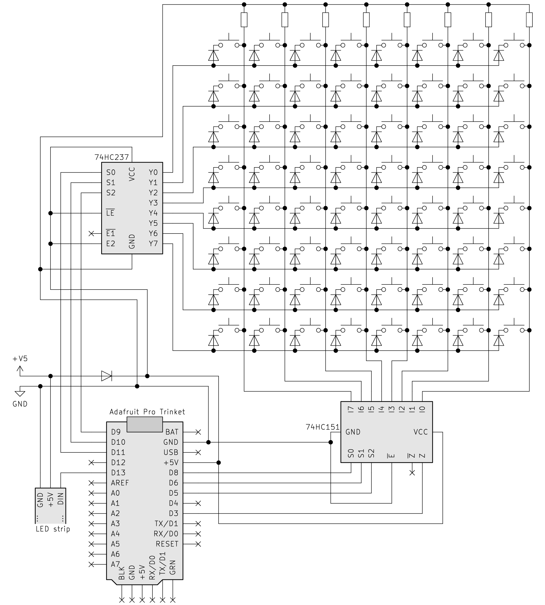

# Schema

Alles bundelend stellen we uiteindelijk het volgende elektrische schema op.

De weerstanden in elke kolom zijn pull-down weerstanden van 10kΩ die het gelezen signaal op `LOW` houden indien er geen knoppen ingedrukt zijn.

De diodes bij de knoppen zelf zijn een klein extraatje met de volgende reden. Veronderstel dat we deze knoppenmatrix zonder diodes opstellen en beschouw daarin twee rijen en twee kolommen. De vier knoppen in de intersectiepunten liggen in een vierkant. Mochten we tegelijkertijd drie van die vier knoppen ingedrukt houden, dan zou de stroom zodanig vloeien dat de microcontroller ook de vierde knop als actief zou registeren. De diodes verhinderen dat er stroom kan terugvloeien en maken zulke verkeerdelijke detecties onmogelijk. Niet bepaald essentieel voor ons project, maar een leuk extraatje.

De extra diode boven de Adafruit Trinket op de tekening werd [eerder](../Project/06.html) reeds verklaard.
