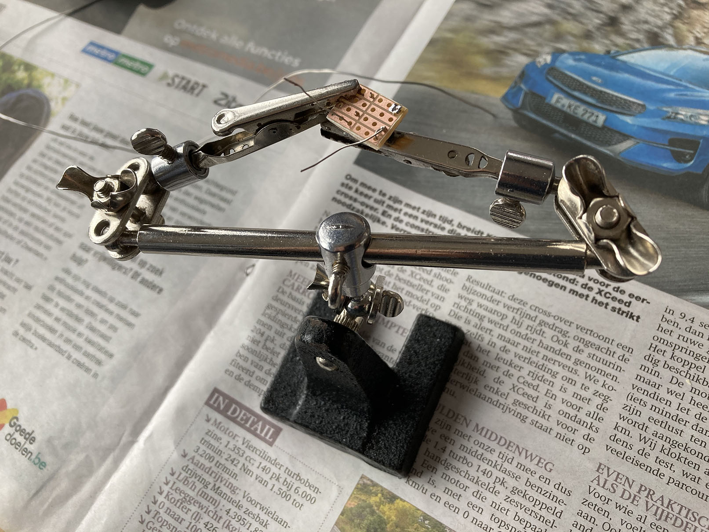
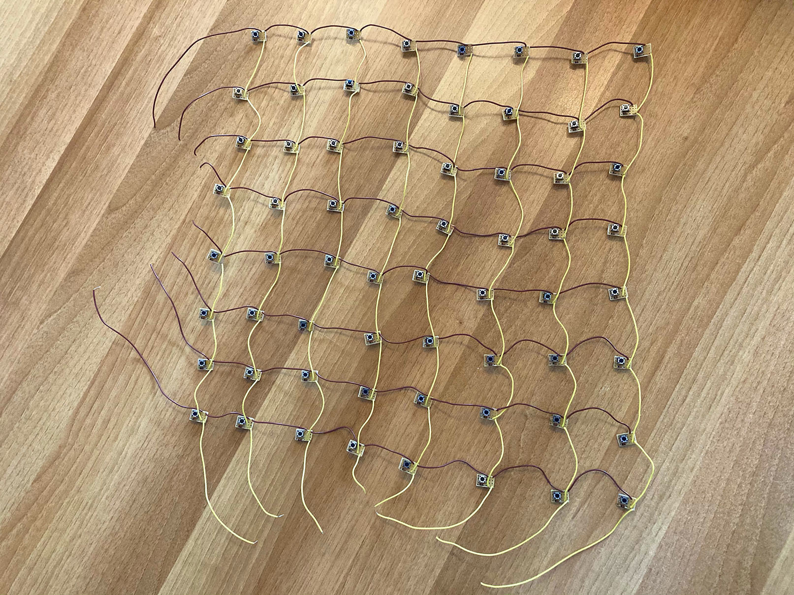

# Solderen (I)

Tot nog toe was het allemaal eerder theoretisch en het wordt tijd om de handen uit de mouwen te steken. We kiezen ervoor om geen printplaat te laten maken om de kosten te drukken, want een printplaat van zo'n 30 op 30 centimeter wordt al een duur grapje, zelfs als er maar weinig baantjes op moeten. Een printplaat volledig zelf maken met ferrochloride of dergelijke technieken had gekund, maar ons circuit is eigenlijk eenvoudig genoeg om gewoon op testprintplaat te solderen. Het handigst lijkt testprint met halfdoorlopende banen, wat betekent dat er telkens eilandjes met drie gaatjes zijn.


 De printplaat snijden we in stukjes van vier op zes gaatjes, waarop we telkens een drukknop en een diode bevestigen. De "uitgang" van de diode wordt verbonden met een pootje van de knop.


Dit handige gereedschap van een vriend (dat hij zijn "derde hand" noemde) bleek best onmisbaar.

<p>


</p>

Daarna knippen we een boel draadjes op lengte en verbinden we de componentjes.


Oef!



En daarna komt het meest gevreesde deel: de hardware debuggen &#9785;

Met een circuitje op de Arduino, dat al gebruik maakt van de multiplexers, kunnen we de knoppen testen. We gebruiken de Arduino omdat we diens _serial monitor_ (wat de Trinket niet heeft) kunnen gebruiken om makkelijk te kunnen volgen op de computer. Telkens als de Arduino een knop detecteert, schrijft die diens "adres" uit op de monitor.

Uiteraard werkte het niet meteen; er bleken systematisch in elke kolom enkele knoppen te zijn die zogezegd ook de onderste knop in die kolom mee activeerden. Na een uur kopzorgen bleek dat op een van de breadboards de grond niet was doorverbonden met de Arduino… met alle bizarre gevolgen van dien. Een _facepalm_ later bleek alles perfect te werken, verbazend genoeg!


(Niet de meest elegante) code om te testen:

```c++
const int ButtonColSel1 = 2;
const int ButtonColSel2 = 3;
const int ButtonColSel3 = 4;

const int ButtonRowSel1 = 11;
const int ButtonRowSel2 = 12;
const int ButtonRowSel3 = 13;

const int ButtonRead = 6;

void setup() {
  pinMode(ButtonColSel1, OUTPUT);
  pinMode(ButtonColSel2, OUTPUT);
  pinMode(ButtonColSel3, OUTPUT);
  pinMode(ButtonRowSel1, OUTPUT);
  pinMode(ButtonRowSel2, OUTPUT);
  pinMode(ButtonRowSel3, OUTPUT);
  pinMode(ButtonRead, INPUT);
  Serial.begin(9600);
}

void loop() {
  //loop over rows
  for (int R = 0; R < 8; ++R) {
    digitalWrite(ButtonRowSel1, R & 1 ? HIGH : LOW);
    digitalWrite(ButtonRowSel2, R & 2 ? HIGH : LOW);
    digitalWrite(ButtonRowSel3, R & 4 ? HIGH : LOW);
    //loop over columns
    for (int C = 0; C < 8; ++C) {
      digitalWrite(ButtonColSel1, C & 1 ? HIGH : LOW);
      digitalWrite(ButtonColSel2, C & 2 ? HIGH : LOW);
      digitalWrite(ButtonColSel3, C & 4 ? HIGH : LOW);
      //check button in R-th row and C-th column
      if (digitalRead(ButtonRead)) {
        Serial.print("KNOP ");
        Serial.print(8*C+R);
        Serial.println(" INGEDRUKT!");
      }
    }
  }
}
```
