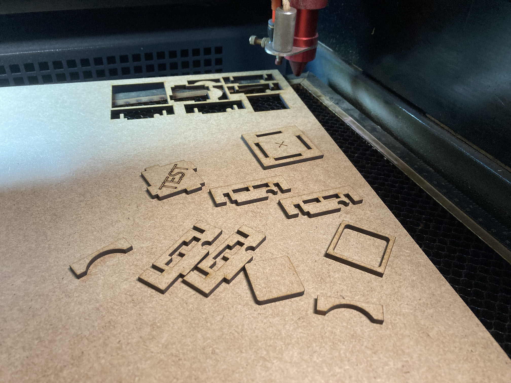
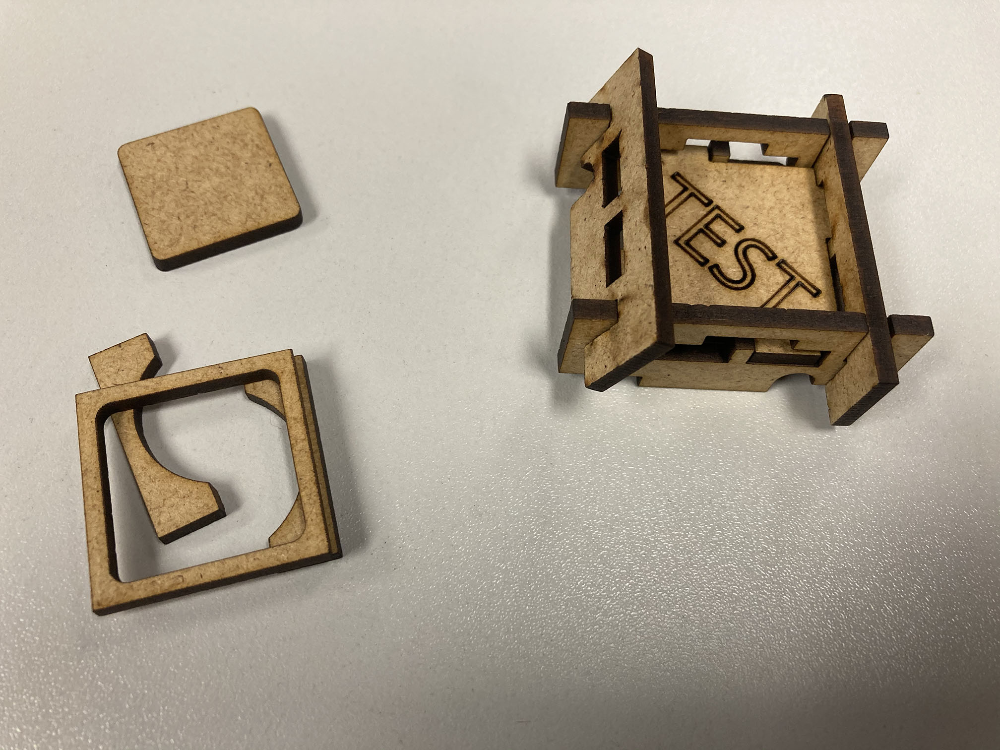
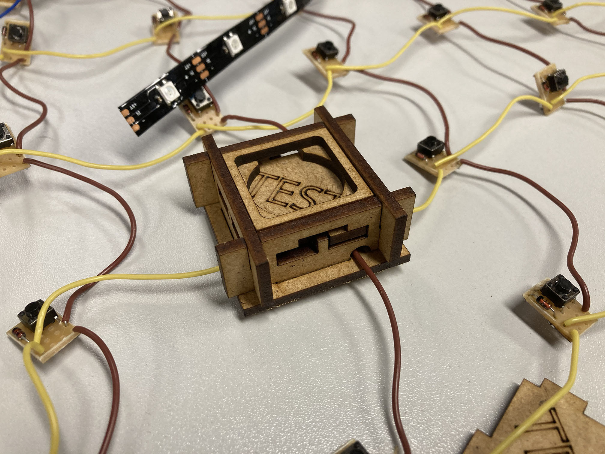
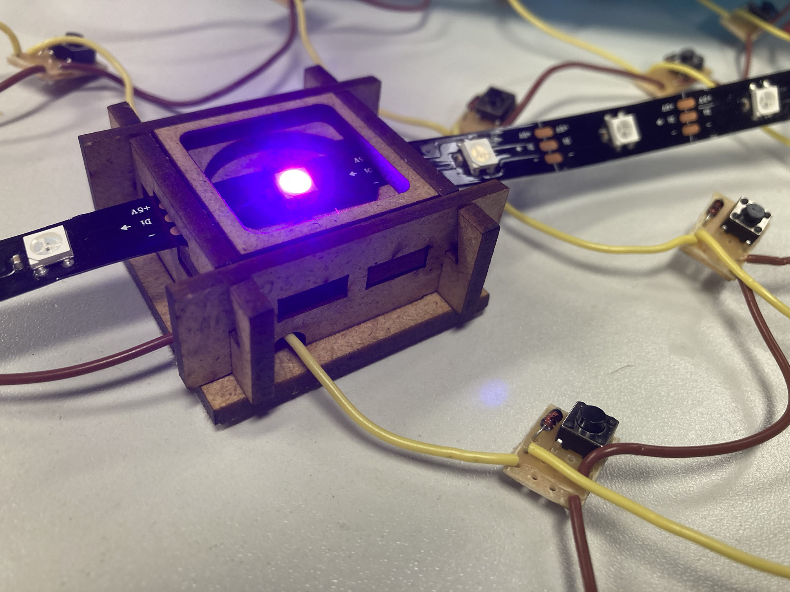
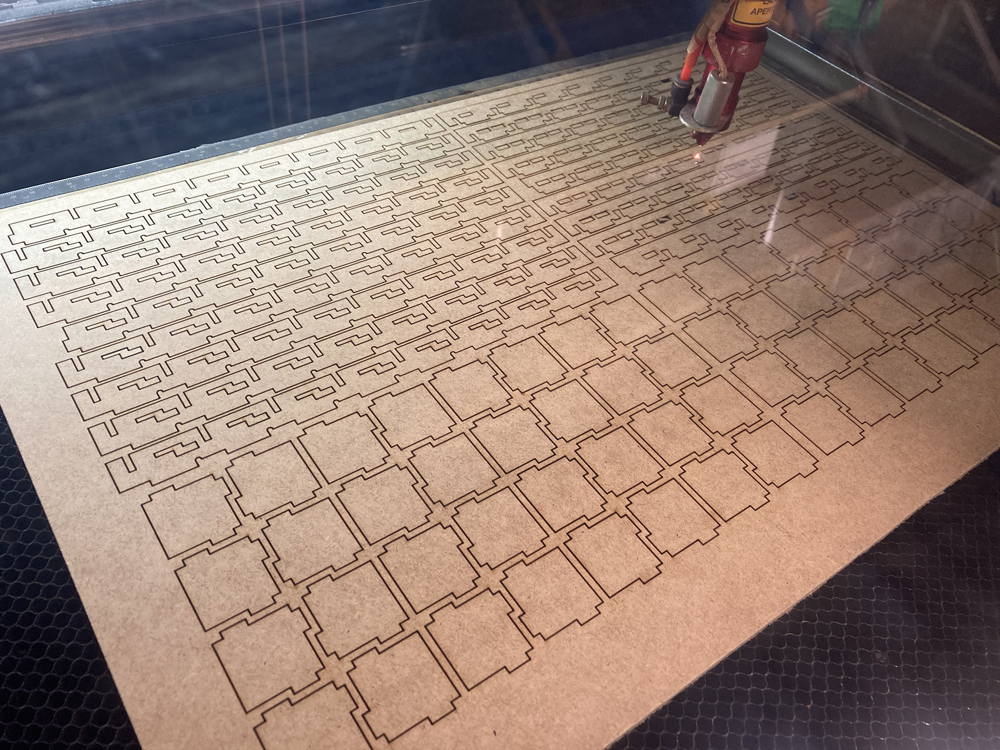
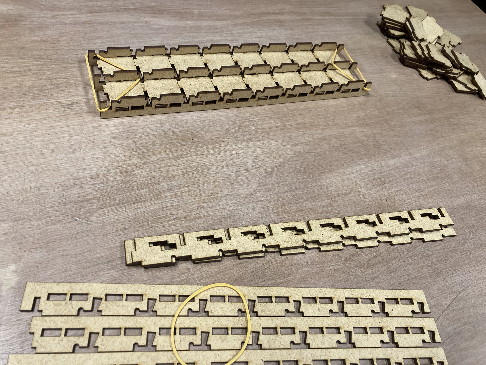
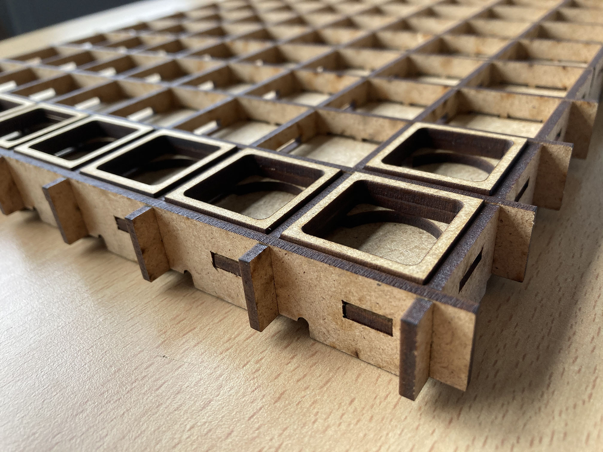

# Houten binnenframe

Een volgende stap is een frame dat alle blokjes en elektronica op hun plaats houdt. Voor de eenvoud en stevigheid maken we een binnenframe uit mdf. Onze eisen zijn eigenlijk niet min: het frame zelf kan bestaan uit in elkaar grijpende stroken, die 64 op-en-neer beweegbare blokjes vasthouden, waardoor bovendien acht led-strips door lopen.
 * Bij voorkeur mogen de blokjes, eenmaal in elkaar gezet, niet uit het frame kunnen vallen (ook al zou het nuttig zijn om de onderliggende elektronica te kunnen zien, we willen niet dat de toetsen in het rond vliegen tijdens transport of bij onhandig gebruik).
 * De blokjes mogen slechts minimaal kunnen bewegen, enkel genoeg om de drukknoppen te activeren.
 * We moeten gaatjes voorzien in het frame voor de elektrische draad.
 * We moeten stroken voorzien in het frame voor de acht led-strips.
 * Er mag geen belasting op de leds terechtkomen, en er mogen eveneens geen obstructies zijn tussen de leds en de bovenste laag in acryl.
 * Als het even kan, willen we het uiteindelijke bord zo laag mogelijk houden &#9786;

Na veel uitdenken en schetsen tekenen, werken we een proefblokje uit in 3mm mdf, rekening houdend met de kerf van de lasersnijder …

… en merken we dat deze niet zo makkelijk in elkaar te puzzelen valt als gehoopt &#9786; In het bijzonder lijkt het lastig om de bodems van de knopjes vier stabiliserende lipjes te geven, zelfs al geven we de stroken langs één kant extra bewegingsvrijheid.

We kunnen wel al uittesten of het blokje mooi past op de elektronische componenten en of er voldoende ruimte boven de leds is voor de nodige diffusie. Dat lijkt best te werken; we zullen wel een extra laag toevoegen aan elk blokje, zodat het acryl een extra 3mm hoger komt te liggen. Een alternatief is om een dunne extra verspreidende laag toe te voegen.

Na enkele kleine aanpassingen maken we het ontwerp op volle grootte, en blijkt de monteerbaarheid nog steeds… best uitdagend, veel meer dan voor een enkel blokje.

Het vergt veel geduld en lichtelijk forceren om alles in elkaar te klikken, maar het lukt!

