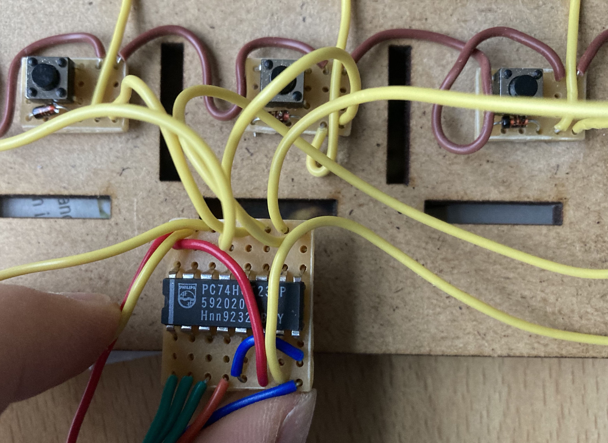
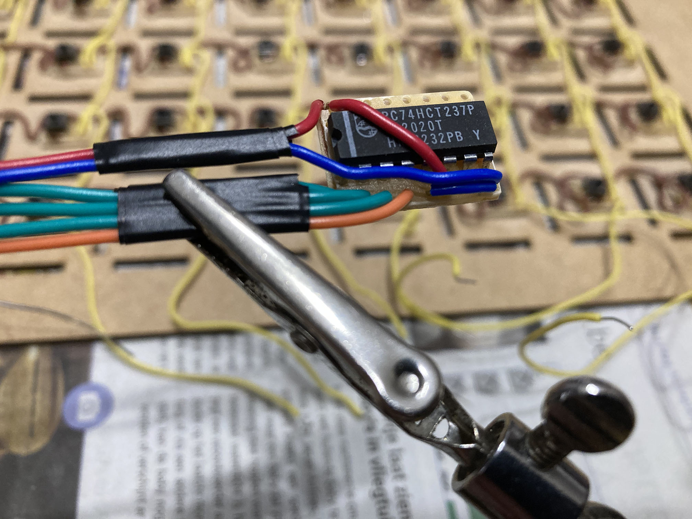
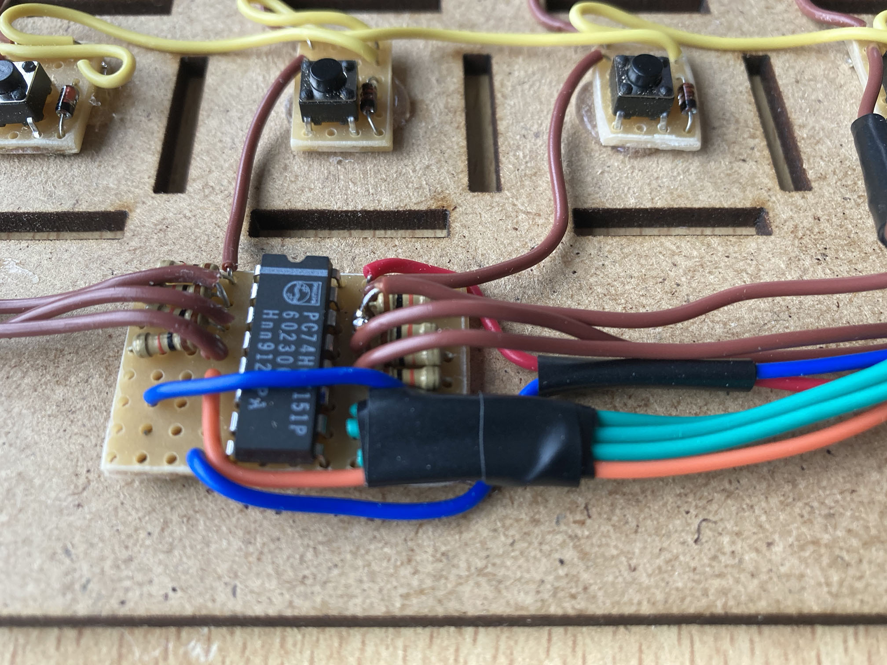
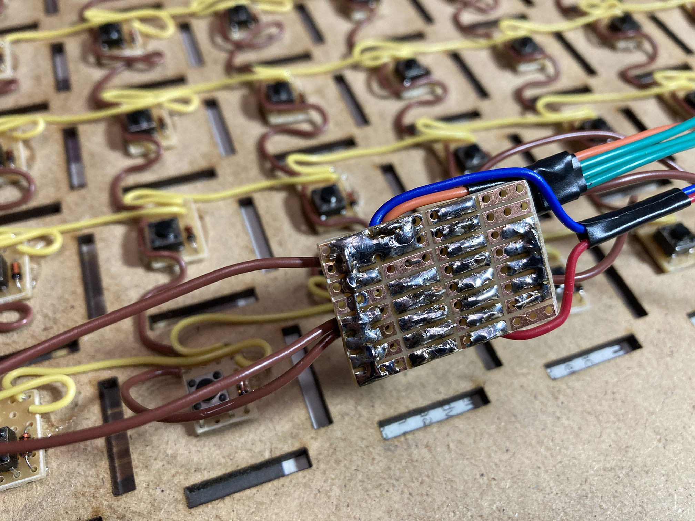
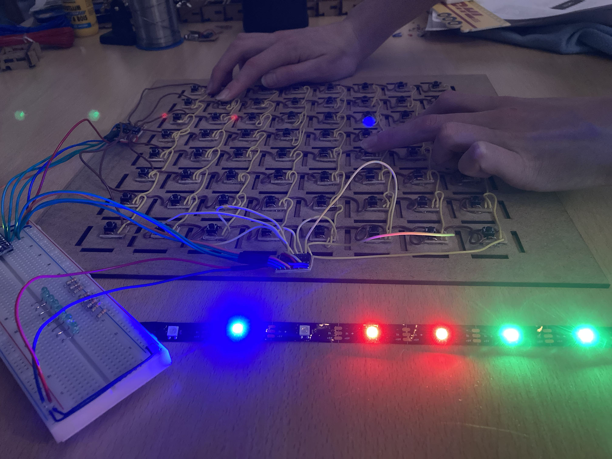
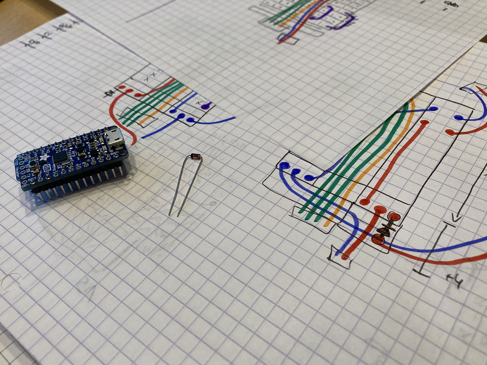
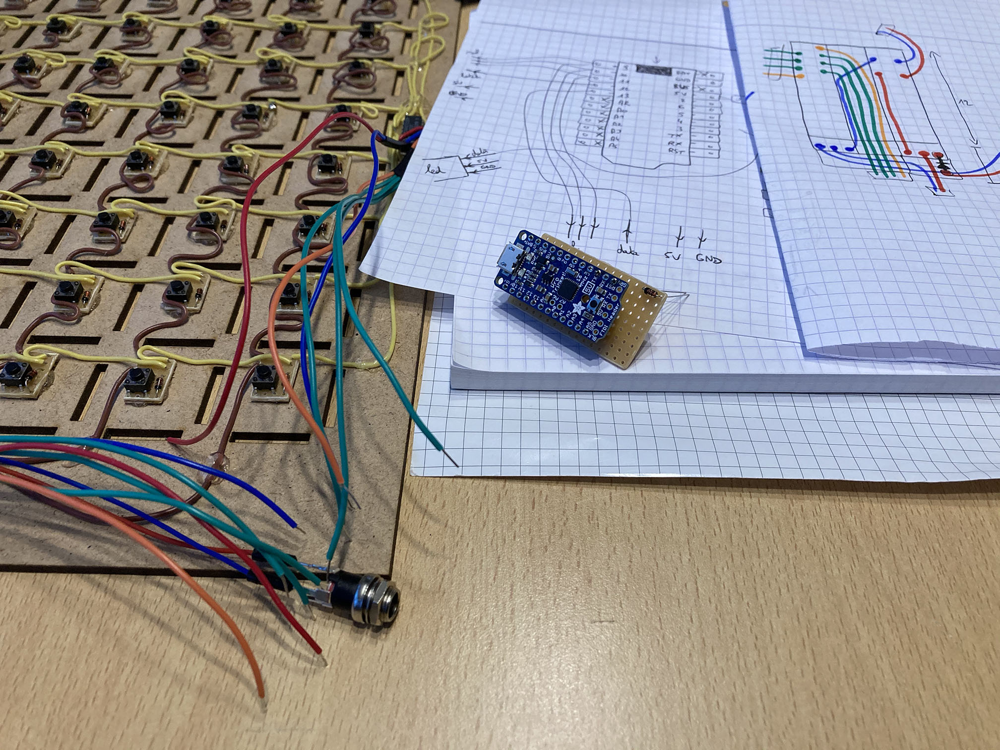
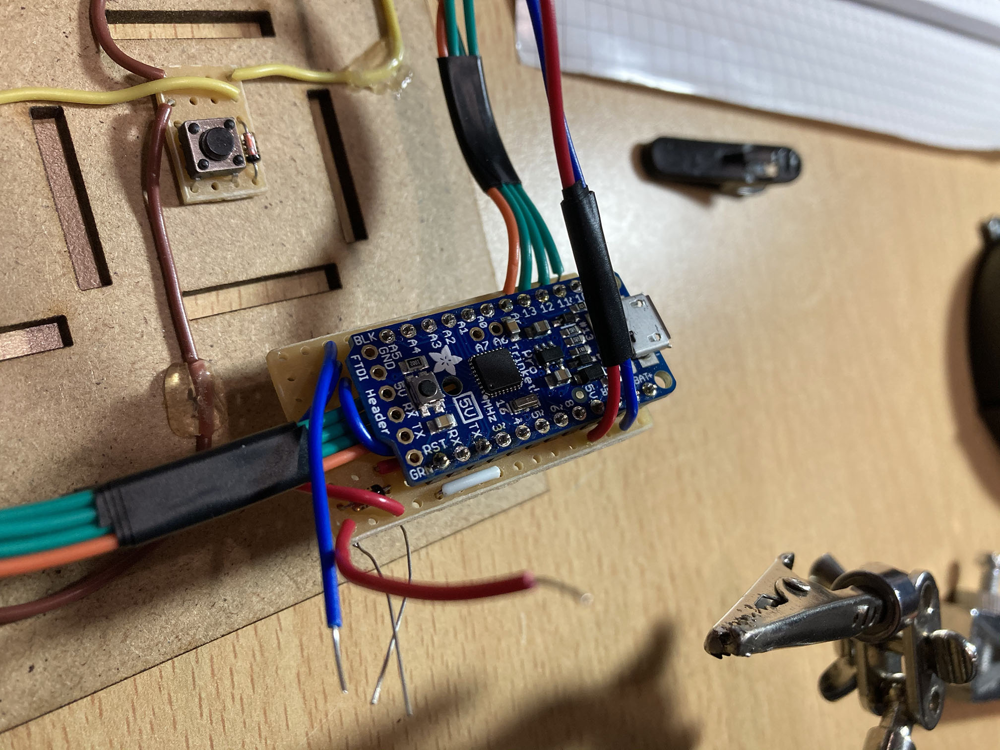

# Solderen (II)

De (de)multiplexer en de Adafruit zelf bevestig ik eveneens op een op maat uitgesneden stukje testprintplaat. Ik begin met de demultiplexer, de 74HCT237. Voor de eerste poging heb ik de beentjes wat naar buiten getrokken, zodat die zó op de testprint zou passen dat er naast elk beentje nog twee gaatjes in hetzelfde eiland zijn. Een overhaaste opzet, want een printplaat van 9 gaatjes breed past niet op de voorziene ruimte. Dat had ik eerder moeten zien.

Dezelfde opzet bij de multiplexer, de 74HC151, leidde tot nog meer ellende. Daar moesten nog weerstanden aan toegevoegd worden aan de ingangen, die over een gezamenlijke lijn naar de grond trekken. Door het ontwerp van de multiplexer zitten er echter zowel links als rechts vier ingangen. Ik wou de grondlijn aan één kant leggen, en dus vier weerstanden over de 74HC151 laten hangen. Zo zat er een open beentje van de weerstand verraderlijk dicht bij de 5V-verbinding, en leek het me toen een goed idee om daar een stuk tape rond te binden. Bij het testen bleek toen dat vier verbindingen slecht contact maakten … wat ik trachtte te fixen met een lijmpistool. Geknoei en geklungel dus, met zo'n beschamend resultaat dat ik er zelfs geen foto van durfde trekken.

Moraal van het verhaal: bij problemen tijdens het solderen van de elektronica, geniet opnieuw nadenken over het ontwerp van de PCB de voorkeur boven meteen proberen _bodgen_ &#9786;

Alles los solderen en terug naar de tekentafel dus. De tweede poging ging beter. De demultiplexer zette ik nu in zijn natuurlijke positie, met naast elk beentje nog één toegankelijk gaatje. Alles past nu op een stukje testprint van zes gaatjes breed. Voor twee gaatjes zijn daar twee draden samen in bevestigd. Ook bleek elektriciteitstape een heel handige manier om het geheel wat overzichtelijk te houden.

Aan de andere kant van het bord koos ik er dan voor om de weerstanden toch braafjes aan de beide kanten van de multiplexer te positioneren en een extra overbruggende verbinding voor de grond toe te voegen. Het stukje testprint was hier wat breder dan eerst, maar op het bord is daar voldoende plaats voor.

Ondertussen testte ik regelmatig met de Adafruit Trinket. Deze voorziet geen seriële monitor, dus ik gebruik een strip van 8 ledjes om te debuggen; bij registratie van een ingedrukte knop gaat een groen ledje branden voor de kolom en een rood ledje voor de rij. Voor een knop op de hoofddiagonaal (gelijke kolom- en rijindex) brandt er één blauwe led. Alles werkt nog steeds!

Ik was best nerveus om de Adafruit Trinket Pro zelf op printplaat te solderen en had daar dan ook heel wat meer tekeningen voor gemaakt. Ook niet vergeten dat daar [een diode](./07.html) tussen moet worden gepuzzeld.

Uiteindelijk viel het best mee, eenmaal duidelijk was dat verbindingen ook onder de Trinket door kunnen lopen (die wordt namelijk enkele millimeters omhoog gehouden door de header pins).

Enkel de voeding en de leds moeten nog worden bevestigd.
