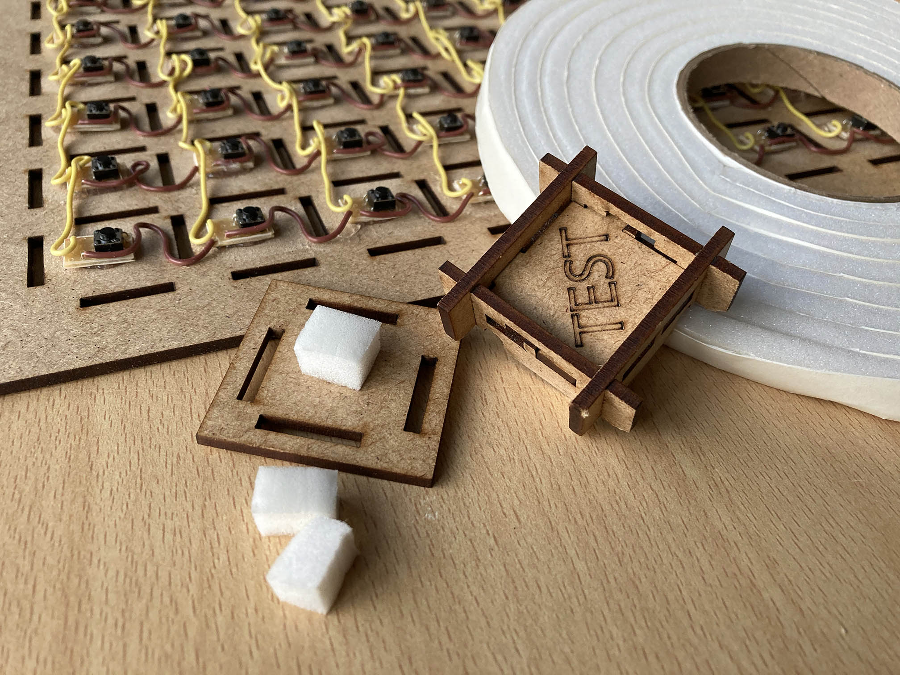
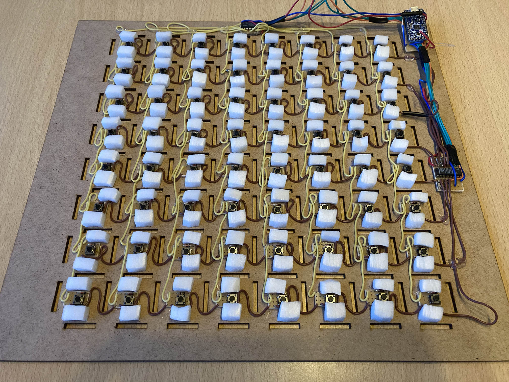
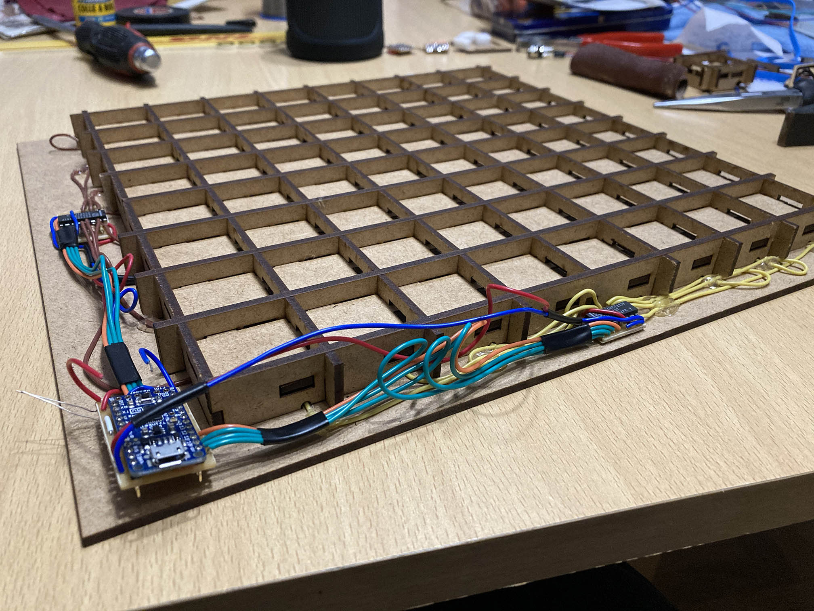
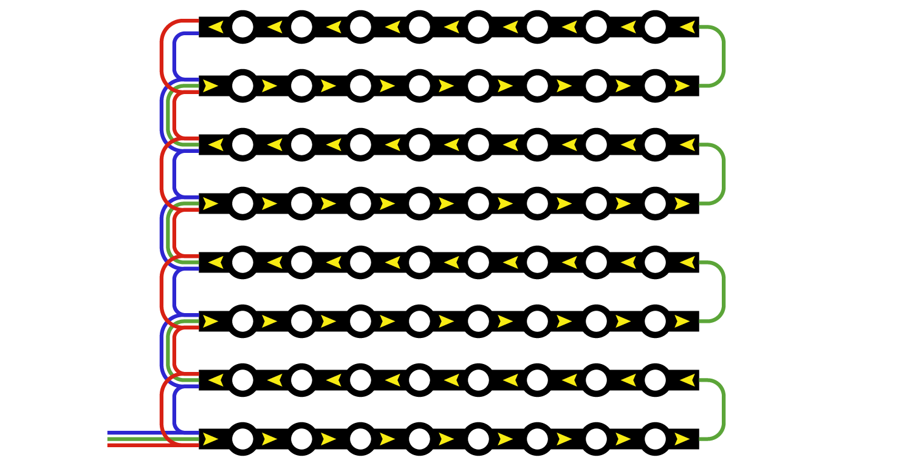
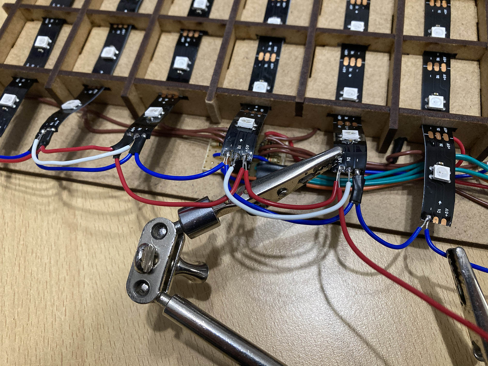
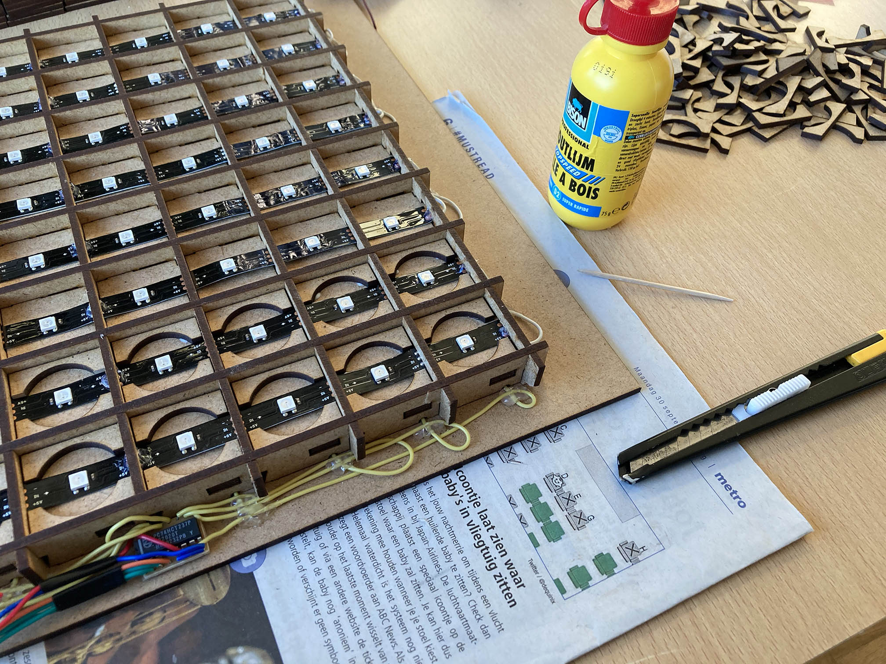
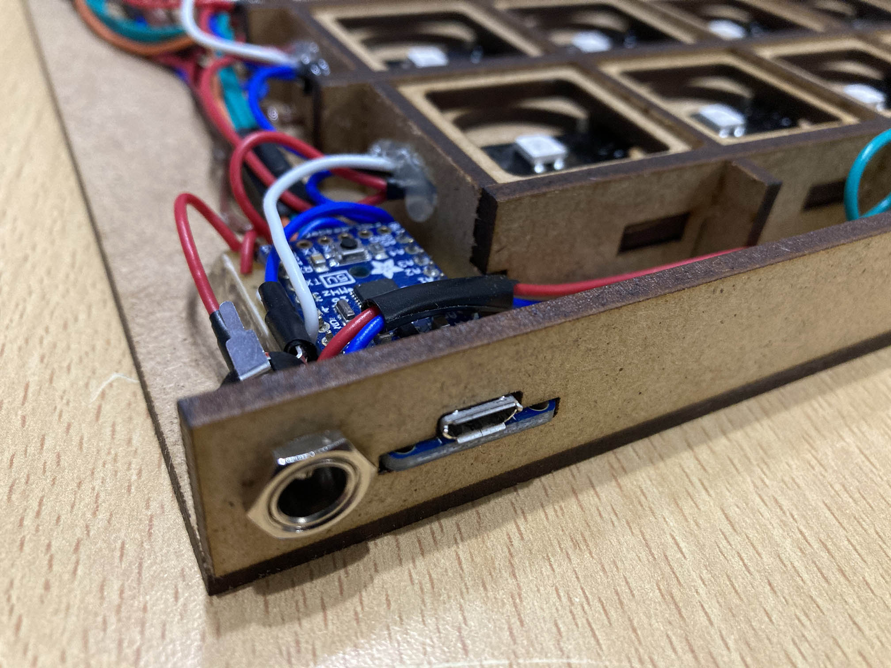
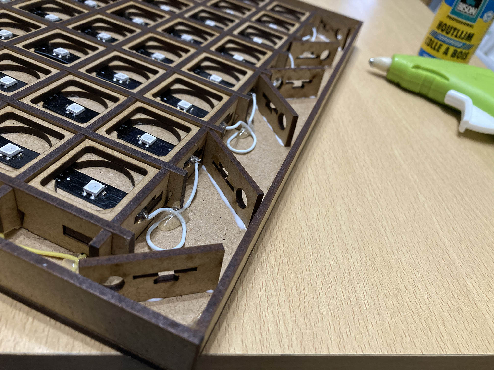

# Framewerk (bis)

Alvorens het binnenframe te bevestigen, wil ik nog een extra stabiliserend element toevoegen in de vorm van foam tape. Ik heb tape gevonden van 7 millimeter dik, en da's juist de hoogte van de drukknoppen op hun plaatjes in rusttoestand. Een test op het klein testblokje demonstreert dat deze foam de knoppen inderdaad wat helpt omhooghouden, al veert het te traag terug om echt een groot verschil te betekenen.

Omdat de foam tape zelfklevend is, gaat het heel vlot om overal enkele afgeknipte eindjes toe te voegen. Ik knip deze lichtjes scheef af zodat ze wat naar de drukknop toe leunen en niet in de weg gaan zitten van het frame. Dan wordt het tijd om de knoppen te verbergen. Ik heb correct rekening gehouden met de kerf van de lasersnijder, want het volstaat om wat kracht te zetten en de hamer te gebruiken om het frame vast te zetten. De muizengaatjes waren aan de kleine kant, maar de draden bleven goed op hun plek en zorgen dus niet voor problemen.

Nu kan ik de ledstrip verknippen in acht kleinere strips met acht ledjes, en begint de grootste uitdaging van alle soldeerwerk… De acht strips krijgen best elk hun eigen voeding in parallel, want anders ontstaat een te groot spanningsverschil tussen de eerste en de laatste led.

De beschikbare ruimte is bijzonder klein en de open eindes van de te solderen verbindingsdraden liggen heel dicht bij elkaar, dus ik omwikkel de uiterste draden met isolerende tape om ongewenst contact te vermijden. Met veel geduld en gepruts lukt het.

Ondertussen soldeer ik ook de ingang voor de voeding vast. Eenmaal het laatste soldeerwerk achter de rug is, plak ik met het lijmpistool de ledstrips vast aan het frame (aan de uiteinden en enkele punten middenin), samen met de multiplexers en de Adafruit zelf.

Daarna kan ik beginnen met het vastplakken van de laagjes hout boven op de knoppen. Waar nodig schuur ik opnieuw lichtjes bij opdat de knop zonder schuren op en neer kan. Niet te veel lijm gebruiken uiteraard, want ik wil niet dat de knoppen vastplakken aan het frame zelf.

Voor de afwerking was het eerste plan om een mooi blok hout met de CNC-frees uit te hollen en rondom het geheel vast te zetten, maar door wijzigingen in het lessenrooster en het wegvallen van de fysieke sessies is dat een onrealistische droom geworden. Daarom houden we het bij een eenvoudigere afwerking met lasergesneden mdf. Dit keer geen tabs om alles aan elkaar te houden, want de bodem heeft die al niet en we moeten op dit punt dan ook sowieso lijm gebruiken. Bovendien wil ik niet te veel kracht moeten zetten of hameren in de buurt van de Trinket en de andere elektronica.

Het vergde een tiental iteraties om de uitsparingen voor de USB-ingang en de voeding goed te krijgen. Deze teststukjes zijn echter geen verloren hout, want ik kan die gebruiken om de "lege" gebieden van wat extra steun te voorzien.

