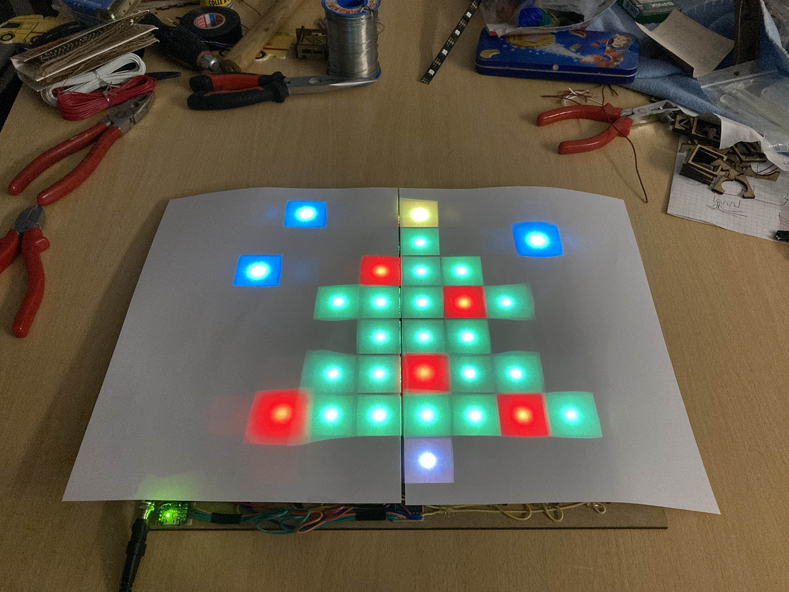

# Software

Ik zal wel tot de minderheid behoren maar het programmeerwerk zag ik meer zitten dan het solderen van alle elektronica. Het begon natuurlijk met een eenvoudig programma dat het overeenkomstige lichtje doet branden wanneer de gebruiker een knop ingedrukt houdt.

De code begint met het declareren van de gebruikte pinnen.
```c++
//declaration of the pins
#define reset 3
#define leddata 5
#define readbutton 9
#define sel1 10
#define sel2 11
#define sel3 12
#define latch 13

//led strip specification
#define ledcount 64
#include <Adafruit_NeoPixel.h>
Adafruit_NeoPixel strip(ledcount, leddata, NEO_GRB + NEO_KHZ800);
```

In de setup doen we niets meer dan de pinnen en de ledstrip initialiseren.

```c++
void setup() {
  pinMode(sel1, OUTPUT);
  pinMode(sel2, OUTPUT);
  pinMode(sel3, OUTPUT);
  pinMode(latch, OUTPUT);
  pinMode(readbutton, INPUT);
  digitalWrite(reset, HIGH);
  pinMode(reset, OUTPUT);
  strip.begin();
}
```
Merk op dat de resetpin van de Trinket steeds op hoog moet blijven, anders reset de Trinket. Omdat de declaratie `pinMode(reset, OUTPUT);` de overeenkomstige pin per default op een _lage_ output zet, moeten we eerst `digitalWrite(reset, HIGH);` oproepen. Vandaar de wat vreemde volgorde.

In de `loop`-methode loop de Trinket steeds opnieuw alle kolommen af, door de selectorlijnen in te stellen en de latch te deactiveren. Vervolgens loopt de Trinket voor elke kolom de rijen af op dezelfde manier. Als de inleespin ooit `HIGH` ontvangt, kunnen we afleiden om welke knop het juist gaat. Het vergt weliswaar een beetje puzzelen en proberen om de getallen goed te krijgen; dat hangt af van de precieze positionering van de selectorlijnen in de multiplexers.

Het programma houdt een array van 64 kleuren bij, die bij elke iteratie van de lus volledig eerst zwart wordt gemaakt. Wordt een knop gedetecteerd, dan zet de Trinket de correcte positie in die array op rood. Tot slot wordt de methode `writeLeds()` opgeroepen die zal zorgen dat de kleuren effectief naar de leds worden gestuurd.

```c++
uint32_t colors [64];

void loop() {
  for (int i = 0; i < 64; ++i)
    colors[i] = 0;
  for (int R = 0; R < 8; ++R) {
    digitalWrite(latch, LOW);
    digitalWrite(sel1, R & 1 ? HIGH : LOW);
    digitalWrite(sel2, R & 2 ? HIGH : LOW);
    digitalWrite(sel3, R & 4 ? HIGH : LOW);
    digitalWrite(latch, HIGH);
    for (int C = 0; C < 8; ++C) {
      digitalWrite(sel1, C & 4 ? HIGH : LOW);
      digitalWrite(sel2, C & 2 ? HIGH : LOW);
      digitalWrite(sel3, C & 1 ? HIGH : LOW);
      if (digitalRead(readbutton))
        colors[8 * R + 7 - C] = 0xff0000;
    }
  }
  writeLeds();
}
```

Deze methode `writeLeds()` is nog niet bijzonder evident om te implementeren, omdat de acht ledstrips telkens omwisselen van volgorde. Vandaar de mysterieuze lijn `i & 8 ? i ^ 7 : i` met het volgende effect. Staat in de binaire voorstelling van `i` op de 8-positie een 0, dan zit led nummer `i` in een ledstrip van links naar rechts en kunnen we gewoon naar de `i`-de led schrijven. Maar staat daar een 1, dan zit led `i` in een ledstrip van rechts naar links en moeten we die nog horizontaal spiegelen, dat wil zeggen, de _x_-coördinaat aftrekken van zeven. Dat is precies wat deze lijn doet, maar dan uitgedrukt in bitsgewijze operatoren.

```c++
void writeLeds() {
  for (int i = 0; i < 64; ++i)
    strip.setPixelColor(i & 8 ? i ^ 7 : i, colors[i]);
  strip.show();
}
```

De volgende methode zullen we nog niet meteen nodig hebben, maar valt al eenvoudig te implementeren.

```c++
void hardreset() {
  digitalWrite(reset, LOW);
}
```

Door de arrray `colors` zelf in te stellen en drukknoppen te negeren, kunnen we ook al statische afbeeldingen weergeven.



```c++
void setup() {
  //initialize pins and leds
  ...
  //declare image
  uint32_t christmas[64] = {
    0x000000, 0x33ffcc, 0x000000, 0x000000, 0xffff00, 0x000000, 0x000000, 0x000000,
    0x000000, 0x000000, 0x000000, 0x000000, 0x13a310, 0x000000, 0x000000, 0x33ffcc,
    0x33ffcc, 0x000000, 0x000000, 0xff0100, 0x128110, 0x13a310, 0x000000, 0x000000,
    0x000000, 0x000000, 0x13a310, 0x13a310, 0x13a310, 0xff0100, 0x128110, 0x000000,
    0x000000, 0x000000, 0x000000, 0x128110, 0x128110, 0x13a310, 0x000000, 0x000000,
    0x000000, 0x000000, 0x128110, 0x128110, 0xff0100, 0x128110, 0x128110, 0x000000,
    0x000000, 0xff0100, 0x13a310, 0x13a310, 0x13a310, 0x13a310, 0xff0100, 0x128110,
    0x000000, 0x000000, 0x000000, 0x000000, 0x404020, 0x000000, 0x000000, 0x000000
  };
  //load image to colors, reflected vertically
  for (int i = 0; i < 8; ++i)
    for (int j = 0; j < 8; ++j)
      colors[8 * i + j] = christmas[8 * (7 - i) + j];
  //show image
  writeLeds();
}
```
