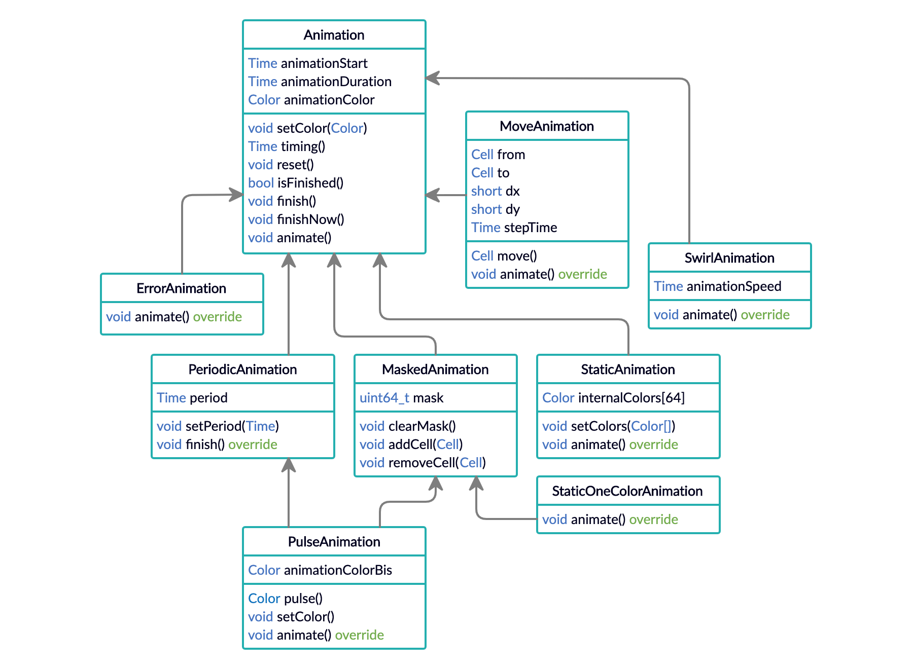

# Software (bis)

Alle volgende code is uiteraard in stapjes gegroeid en ik kan onmogelijk alle tussenstappen van uitgebreide documentatie voorzien. Ook kan ik er niet onderuit om bij de lezer een degelijke basis aan programmeren te moeten veronderstellen.

Om de software wat te structuren, maak ik onderscheid tussen de zuiver hardwarematige functionaliteit (zoals het detecteren van knoppen), zuiver visuele functionaliteit (het oplichten van de leds), en spelgerelateerde functionaliteit. De bedoeling is idealiter om de eindgebruiker enkel op te zadelen met het implementeren van deze laatste soort.

Handig in elke situatie is een nieuwe datastructuur om de 64 velden makkelijk toegankelijk te maken. `Cell(a, b)` stelt het veld voor in rij `a` en kolom `b`, geteld vanaf 0 en met de Trinket linksonder als referentie. We indexeren deze velden intern met een byte die een getal tussen 0 en 64 voorstelt, wat de leuke handigheid heeft dat we deze objecten eenvoudig kunnen gebruiken om arrays te indexeren.

Een byte reikt tot en met 255 en we hebben dus eigenlijk twee bits over. We maken hiervan gebruik om ook een niet-fysiek-bestaand veld `NullCell()` te definiëren, dat in allerlei contexten nuttig kan zijn (bijvoorbeeld als defaultwaarde voor een methode die een veld als argument neemt).

```c++
class Cell {
  public:
    //internal variable
    byte xy;
    byte x() {
      return xy & 7;
    }
    byte y() {
      return xy >> 3;
    }
    //constructor
    Cell(byte x0 = 0, byte y0 = 0) {
      xy = (y0 & 7) << 3 | (x0 & 7);
    }
    //equality definition
    bool operator == (const Cell& other) {
      return this->xy == other.xy;
    }
};

//"non-existing" cell (outside the board)
class NullCell : public Cell {
  public:
    NullCell () {
      // 10000000
      xy = 1 << 7;
    }
};
```

We gebruiken deze objecten al in de volgende methode, die het detecteren van de knoppen op zich neemt en zo enkele nog te definiëren methodes triggert.

```c++
/* Placeholders, to be defined in main file */
void buttonPressed(Cell cell);
void buttonReleased(Cell cell);
void buttonHeldFor(Cell cell, Time t);

/* Detect button presses and releases. */
enum ButtonState {buttonUp = 0, buttonDown = 1};
ButtonState buttonStates[64];
Time lastTimePressed;

void detectButtons() {
  for (int R = 0; R < 8; ++R) {
    digitalWrite(latchPin, LOW);
    digitalWrite(sel1Pin, R & 1 ? HIGH : LOW);
    digitalWrite(sel2Pin, R & 2 ? HIGH : LOW);
    digitalWrite(sel3Pin, R & 4 ? HIGH : LOW);
    digitalWrite(latchPin, HIGH);
    for (int C = 0; C < 8; ++C) {
      digitalWrite(sel1Pin, C & 4 ? HIGH : LOW);
      digitalWrite(sel2Pin, C & 2 ? HIGH : LOW);
      digitalWrite(sel3Pin, C & 1 ? HIGH : LOW);
      Cell currentCell = Cell(R, 7 - C);
      if (digitalRead(readButtonPin)) {
        if (buttonStates[currentCell.xy] == buttonUp) {
          //just been pressed
          lastTimePressed = millis();
          buttonPressed(currentCell);
          buttonStates[currentCell.xy] = buttonDown;
        }
      } else if (buttonStates[currentCell.xy] == buttonDown) {
        //just been released
        buttonHeldFor(currentCell, millis() - lastTimePressed);
        buttonReleased(currentCell);
        buttonStates[currentCell.xy] = buttonUp;
      }
    }
  }
}
```

Merk op dat dit nog enig "misbruik" toelaat, want als je een knop indrukt houdt en een nieuwe knop indrukt, klopt de bijgehouden tijd niet volledig. Maar om nu een array van 64 _unsigned longs_ bij te houden… Zoveel werkgeheugen heeft de Trinket helaas niet. Hier kom ik later nog op terug.

Om richting het grafische te gaan, definiëren we eerst een klasse die ons toelaat om met kleuren te spelen. Elk kleur wordt voorgesteld door de rgb-waarden, drie getallen tussen 0 en 255 die dus elk 8 bits in beslag nemen. We voorzien ook manieren om kleuren te mengen en donkerder te maken.

```c++
class Color {
  public:
    uint8_t r;
    uint8_t g;
    uint8_t b;
    uint32_t rgb() {
      return ((uint32_t) r << 16) | ((uint32_t) g << 8) | b;
    }

    //constructors
    Color(uint32_t rgb0 = 0x000000) :
      r((rgb0 >> 16) & 0xff), g((rgb0 >> 8) & 0xff), b(rgb0 & 0xff) {}
    Color(uint8_t r0, uint8_t g0, uint8_t b0) :
      r(r0), g(g0), b(b0) {}

    //linear interpolation
    Color mixWith(Color color2, uint8_t p) {
      color2.r = ((255 - p) * r + p * color2.r) / 255;
      color2.g = ((255 - p) * g + p * color2.g) / 255;
      color2.b = ((255 - p) * b + p * color2.b) / 255;
      return color2;
    }

    //p = 0 => black, p = 255 => no difference
    Color darker(uint8_t p) {
      return mixWith(Color(0x000000), 255 - p);
    }
};
```

Die kleuren kunnen we meteen inzetten in onze methode `writeLeds()`.

```c++
/* Global holding the colors to be displayed.*/
Color leds[64];

/* Send leds to the led strip, "snakewise". */
void writeLeds() {
  for (int i = 0; i < 64; ++i)
    strip.setPixelColor(i & 8 ? i ^ 7 : i, leds[i].rgb());
  strip.show();
}
```

Een groot struikelblok bleek het gebruik van animaties, die bijvoorbeeld met een pulserend effect aangeven welke stukken actief zijn of die de kleuren op bord effectief in een bepaalde richting doen bewegen. Daartoe dient een abstracte klasse `Animation`, die een starttijd bijhoudt, een duurtijd, en een kleur, en die een cruciale methode `animate()` declareert die de concrete animatie berekent uit de huidige tijd. Ook implementeren we al enkele generieke methoden om met kleuren en tijd om te gaan.

```c++
class Animation {
  public:
    //internal data
    Time animationStart;
    Time animationDuration = 0;
    Color color = Color(0x000000);

    //non-instantiable constructor
    Animation () {};

    //destructor
    virtual ~Animation() = default;

    //animate function
    virtual void animate();

    //color method
    virtual void setColor(Color color0) {
      color = color0;
    }

    //timing purposes
    unsigned long timing() {
      return millis() - animationStart;
    }

    void reset() {
      animationStart = millis();
    }

    virtual bool isFinished() {
      return animationDuration && timing() > animationDuration;
    }

    virtual void finish() {
      animationDuration = timing();
    }

    void finishNow() {
      animationDuration = timing();
    }
};
```

Twee families animaties die extra functionaliteit implementeren, zijn de klassen `PeriodicAnimation` (die een periodiek effect hebben en ook pas afgebroken zullen worden na een geheel aantal perioden) en `MaskedAnimation` (die op een variabel aantal velden van toepassing zijn). Concretere klassen zoals `ErrorAnimation`, `SwirlAnimation` en `PulseAnimation` krijgen dan elk hun concrete implementatie van de methode `animate()`. Hier volgt een klassediagram.



De bronbestanden met volledige code zijn terug te vinden op de pagina [Bronbestanden](./16.html). Om één voorbeeld te geven van zo'n `animate()`-implementatie, staat hieronder die van de `SwirlAnimation`. Die heeft als effect dat er vier cellen langs de rand rondom het bord lijken te lopen, een leuk effect om bijvoorbeeld de winnaar van een spel aan te duiden. De methode berekent uit de huidige tijd en de snelheid van de animatie welke cellen op de rand op dit moment ingekleurd moeten zijn en overschrijft de juiste cellen in de globale array `leds`.

```c++
void animate() override {
  uint8_t i = (timing() / animationSpeed) % 7;
  leds[Cell(0, i).xy] = animationColor;
  leds[Cell(i, 7).xy] = animationColor;
  leds[Cell(7, 7 - i).xy] = animationColor;
  leds[Cell(7 - i, 0).xy] = animationColor;
}
```

```c++
class AnimationManager {
  public:
    Stack<Pair<Animation*, bool>> animationStack;

    void startAnimation(Animation* animation, bool shouldDestruct = false) {
      animationStack.push({animation, shouldDestruct});
    }

    unsigned int numberOfLayers() const {
      return animationStack.size();
    }

    void animate() {
      animationStack.filter([] (Pair<Animation*, bool> &pair) {
        if (pair.first->isFinished()) {
          if (pair.second)
            delete pair.first;
          return false;
        } else
          return true;
      });
      for (Pair<Animation*, bool> &pair : animationStack)
        pair.first->animate();
    }
};
```
